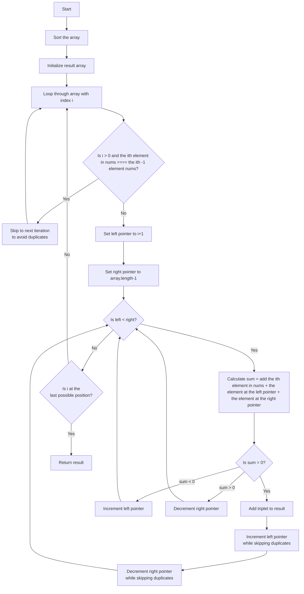

# **3Sum Solution Flowchart**

```mermaid
flowchart TD
    A[Start] --> B[Sort the array]
    B --> C[Initialize result array]
    C --> D[Loop through array with index i]
    D --> E{Is i > 0 and the ith element in nums ==== the ith -1 element nums?}
    E -- Yes --> F[Skip to next iteration\nto avoid duplicates]
    F --> D
    E -- No --> G[Set left pointer to i+1]
    G --> H[Set right pointer to array.length-1]
    H --> I{Is left < right?}
    I -- Yes --> J[Calculate sum = add the ith element in nums + the element at the left pointer + the element at the right pointer]
    J --> K{Is sum = 0?}
    K -- Yes --> L[Add triplet to result]
    L --> M[Increment left pointer\nwhile skipping duplicates]
    M --> N[Decrement right pointer\nwhile skipping duplicates]
    N --> I
    K -- sum < 0 --> O[Increment left pointer]
    O --> I
    K -- sum > 0 --> P[Decrement right pointer]
    P --> I
    I -- No --> Q{Is i at the \nlast possible position?}
    Q -- Yes --> R[Return result]
    Q -- No --> D
```
