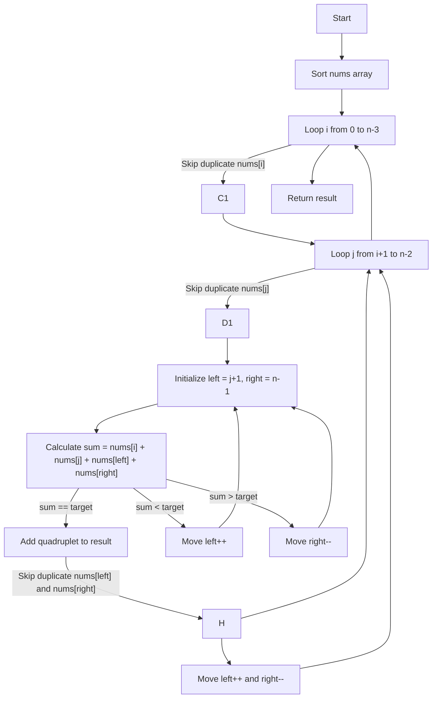

# **4Sum**

## Understanding the Problem  

We are given an array of integers and need to find all unique quadruplets \([a, b, c, d]\) such that their sum equals a given target. Each number in the array can only be used once per quadruplet. The order in which the quadruplets appear in the output does not matter.  

---

### Understanding the Constraints  

- 1 <= nums.length <= 200:  
  - The array size is reasonable for an O(n^2) or O(n^3) approach but not for an O(n^4) brute-force solution.
- -10^9 <= nums[i] <= 10^9:  
  - The numbers can be large, so integer overflow should be considered.
- -109 <= target <= 109:  
  - A wide range of possible targets, requiring careful summation to avoid exceeding limits.

---

### **Breaking Down the Problem**  

Since a naive brute-force approach O(n^4) is too slow, we need to optimize it. We can leverage sorting and the **two-pointer technique**, similar to the **3Sum problem**.

---

### **Pattern Identification: Two Pointers**

This problem is an extension of the **3Sum problem**, which itself is an extension of **2Sum**. The idea is:

1. Sort the array.
2. Fix two numbers in the quadruplet.
3. Use a two-pointer approach to find the remaining two numbers.

---

## **Approach to Solving the Problem**

### **Step 1: Sort the Array**

Sorting helps in avoiding duplicate quadruplets and efficiently applying the two-pointer technique.

### **Step 2: Iterate with Two Nested Loops**

- The first two loops will iterate over potential first and second elements of the quadruplet.

### **Step 3: Apply the Two-Pointer Technique**

- For each fixed pair (i, j), use two pointers to search for the remaining two elements whose sum equals target - nums[i] + nums[j].
- Move pointers accordingly based on sum comparison.

### **Step 4: Handle Duplicates**

- If we encounter duplicate values, we skip them to ensure unique quadruplets.

---

### **Code Implementation (JavaScript)**

```javascript
var fourSum = function(nums, target) {
    nums.sort((a, b) => a - b); // Step 1: Sort the array
    let result = [];
    
    for (let i = 0; i < nums.length - 3; i++) {
        if (i > 0 && nums[i] === nums[i - 1]) continue; // Skip duplicates for i

        for (let j = i + 1; j < nums.length - 2; j++) {
            if (j > i + 1 && nums[j] === nums[j - 1]) continue; // Skip duplicates for j
            
            let left = j + 1, right = nums.length - 1;
            let targetSum = target - (nums[i] + nums[j]);

            while (left < right) {
                let sum = nums[left] + nums[right];

                if (sum === targetSum) {
                    result.push([nums[i], nums[j], nums[left], nums[right]]);
                    
                    // Skip duplicate values
                    while (left < right && nums[left] === nums[left + 1]) left++;
                    while (left < right && nums[right] === nums[right - 1]) right--;

                    left++;
                    right--;
                } else if (sum < targetSum) {
                    left++; // Increase sum
                } else {
                    right--; // Decrease sum
                }
            }
        }
    }
    return result;
};
```

---

## **Complexity Analysis**

- **Sorting**: `O(n log n)`
- **Nested loops**: `O(n^2)`
- **Two-pointer search**: `O(n)`

Thus, the overall time complexity is **O(n^3)**, which is optimal for this problem.

The space complexity is **O(1)** if we ignore the result storage.

---

## **Alternative Approaches**

### **1. Hash Table (Trade-Off: Extra Space)**

- Use a hash table to store previous sums and check for complementary pairs.
- Reduces some computations but increases memory usage.

### **2. k-Sum Generalization**

- Extend this approach for **k-sum problems** (e.g., 3Sum, 5Sum) using recursion.

---

## **Similar Problems for Practice**

1. **Two Sum** → [Leetcode #1](https://leetcode.com/problems/two-sum/)
2. **Three Sum** → [Leetcode #15](https://leetcode.com/problems/3sum/)
3. **K-Sum Variants** → Expand the approach to k-Sum problems.

---

## **Flowchart**



---

## **Final Takeaway**

- The **two-pointer approach** is a powerful technique for sum problems.
- Sorting helps eliminate duplicates and optimize search operations.
- The **k-Sum** problem follows a similar pattern and can be solved recursively.

Would you like to see variations on 3Sum or 2Sum for more practice? 🚀
