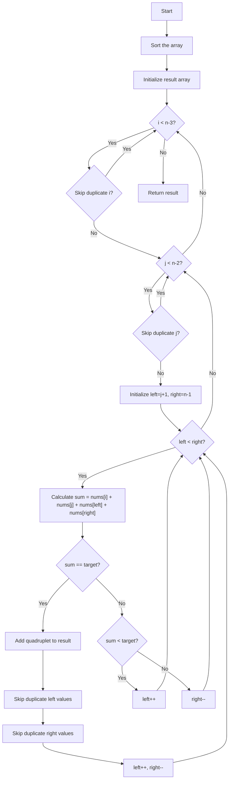

# **4Sum Flowchart**

```mermaid
flowchart TD
    A[Start] --> B[Sort the array]
    B --> C[Initialize result array]
    C --> D{i < n-3?}
    D -->|Yes| E{Skip duplicate i?}
    D -->|No| Z[Return result]
    E -->|Yes| D
    E -->|No| F{j < n-2?}
    F -->|Yes| G{Skip duplicate j?}
    F -->|No| D
    G -->|Yes| F
    G -->|No| H[Initialize left=j+1, right=n-1]
    H --> I{left < right?}
    I -->|Yes| J["Calculate sum = nums[i] + nums[j] + nums[left] + nums[right]"]
    I -->|No| F
    J --> K{sum == target?}
    K -->|Yes| L[Add quadruplet to result]
    K -->|No| M{sum < target?}
    L --> N[Skip duplicate left values]
    N --> O[Skip duplicate right values]
    O --> P[left++, right--]
    P --> I
    M -->|Yes| Q[left++]
    M -->|No| R[right--]
    Q --> I
    R --> I
```
