# LeetCode 1577 — Number of Ways Where Square of Number Equals Product of Two Numbers

---

## 1. Problem Understanding (Simple Terms)

Imagine you have two bags of numbers — `nums1` and `nums2`. You want to find "magic triplets" where one number from one bag, when **squared**, equals the **product of two numbers** from the other bag.

There are two flavors:

- **Type 1:** Pick one number from `nums1`, square it → must equal the product of two *different-indexed* numbers from `nums2`
- **Type 2:** Pick one number from `nums2`, square it → must equal the product of two *different-indexed* numbers from `nums1`

Count ALL such valid triplets and return the total.

**Key clarification on indices:** For `(i, j, k)`, we require `j < k` — so order matters for index selection, but the pair `(j, k)` is not double-counted.

---

## 2. Technical Explanation

We are looking for triplets satisfying:

**Type 1:** $\text{nums1}[i]^2 = \text{nums2}[j] \times \text{nums2}[k]$, where $j < k$

**Type 2:** $\text{nums2}[i]^2 = \text{nums1}[j] \times \text{nums1}[k]$, where $j < k$

Both types are essentially the **same subproblem** — count triplets where a square from array A equals a product of a pair from array B. We just swap the roles of the two arrays for each type.

This reduces to writing one helper function: `countTriplets(A, B)` and calling it twice.

---

## 3. What The Constraints Tell Us

| Constraint                                | Insight                                                           |
|-------------------------------------------|-------------------------------------------------------------------|
| `1 <= nums1.length, nums2.length <= 1000` | An O(n²) or O(n·m) solution is acceptable — up to ~10⁶ operations |
| `1 <= nums1[i], nums2[i] <= 10⁵`          | Squares can reach 10¹⁰ — use `long`/`BigInt`, not `int`           |
| No negative numbers                       | No need to worry about sign flips when multiplying                |
| Values ≥ 1                                | Products are always positive, no zero-division edge cases         |

The size constraints are a green light for a **brute force O(n·m²)** approach, which at worst is `1000 × 1000² = 10⁹`... actually that's too slow. But notice: we can use a **frequency map** to bring it down to **O(n·m)**.

---

## 4. 🔑 Keywords to Recognize Similar Problems

- **"Square of one number equals product of two others"** → Hash map frequency counting
- **"Count pairs/triplets"** → Think frequency maps or two pointers
- **"Two separate arrays, symmetric condition"** → Write one helper, call it twice
- **"j < k constraint"** → Unordered pairs → use combination math: `C(count, 2) = count*(count-1)/2`

---

## 5. Break Down the Problem

```Javascript
Full Problem
│
├── Type 1: countTriplets(nums1, nums2)
│   ├── For each value in nums1 → compute its square (target)
│   └── Count pairs in nums2 whose product = target
│
└── Type 2: countTriplets(nums2, nums1)
    ├── For each value in nums2 → compute its square (target)
    └── Count pairs in nums1 whose product = target

Answer = Type1 + Type2
```

**The core subproblem:** Given a `target`, how many pairs `(j, k)` with `j < k` exist in array `B` such that `B[j] * B[k] == target`?

Using a **frequency map of B**:

- For each element `x` in `B`, check if `target % x == 0` (i.e., `target/x` is an integer)
- Let `complement = target / x`
- If `complement` exists in the frequency map:
  - If `complement == x` → pairs = `freq[x] * (freq[x]-1) / 2`
  - If `complement != x` → pairs = `freq[x] * freq[complement]` (but divide by 2 at end to avoid double-counting)

---

## 6. Pattern Identification

**Primary Pattern:
Hash Map Frequency Counting**

This is a variant of the classic **"Two Sum"** pattern extended to products. Instead of looking for `a + b = target`, we look for `a * b = target`. The frequency map lets us answer this in O(1) per lookup.

**Secondary Pattern:
Problem Symmetry / Helper Function Abstraction**

Recognizing that Type 1 and Type 2 are mirror images means we write the logic once and reuse it — a key interview skill.

---

## 7. Step-by-Step Approach

**Step 1:** Build a frequency map of array `B` (counts occurrences of each number).

**Step 2:** For each element `val` in array `A`, compute `target = val * val`.

**Step 3:** Iterate over each unique key `x` in the frequency map of `B`:

- Check if `target % x == 0` (no remainder)
- Compute `complement = target / x`
- If `complement` exists in the map:
  - If `x == complement`: add `freq[x] * (freq[x] - 1) / 2` to count (pairs within same value)
  - If `x < complement`: add `freq[x] * freq[complement]` to count (use `x < complement` to avoid double-counting)

**Step 4:** Call this helper with `(nums1, nums2)` and then `(nums2, nums1)`. Sum the results.

---

## 8. Code Implementation

### JavaScript

```javascript
/**
 * @param {number[]} nums1
 * @param {number[]} nums2
 * @return {number}
 */
var numTriplets = function(nums1, nums2) {
    return countTriplets(nums1, nums2) + countTriplets(nums2, nums1);
};

/**
 * Counts triplets where A[i]^2 == B[j] * B[k], j < k
 */
function countTriplets(A, B) {
    // Step 1: Build frequency map for array B
    const freqMap = new Map();
    for (const num of B) {
        freqMap.set(num, (freqMap.get(num) || 0) + 1);
    }

    let count = 0;

    // Step 2: For each element in A, find valid pairs in B
    for (const val of A) {
        const target = val * val; // Use BigInt if needed, but JS handles this fine here

        // Step 3: Check each unique value in B
        for (const [x, freqX] of freqMap) {
            // x must divide target evenly
            if (target % x !== 0) continue;

            const complement = target / x;

            // Only process x <= complement to avoid double-counting pairs
            if (x > complement) continue;

            if (!freqMap.has(complement)) continue;

            const freqC = freqMap.get(complement);

            if (x === complement) {
                // Pairs within the same value group: C(freqX, 2)
                count += (freqX * (freqX - 1)) / 2;
            } else {
                // x < complement: multiply their frequencies
                count += freqX * freqC;
            }
        }
    }

    return count;
}
```

### Java

```java
class Solution {
    public int numTriplets(int[] nums1, int[] nums2) {
        // Combine both types using helper
        return countTriplets(nums1, nums2) + countTriplets(nums2, nums1);
    }

    /**
     * Counts triplets where A[i]^2 == B[j] * B[k], j < k
     */
    private int countTriplets(int[] A, int[] B) {
        // Step 1: Build frequency map for array B
        Map<Long, Long> freqMap = new HashMap<>();
        for (int num : B) {
            freqMap.merge((long) num, 1L, Long::sum);
        }

        int count = 0;

        // Step 2: For each element in A, compute target = val^2
        for (int val : A) {
            long target = (long) val * val; // Cast to long to prevent overflow

            // Step 3: Check each unique value x in B's frequency map
            for (Map.Entry<Long, Long> entry : freqMap.entrySet()) {
                long x = entry.getKey();
                long freqX = entry.getValue();

                // x must evenly divide target
                if (target % x != 0) continue;

                long complement = target / x;

                // Only process x <= complement to avoid double-counting
                if (x > complement) continue;

                if (!freqMap.containsKey(complement)) continue;

                long freqC = freqMap.get(complement);

                if (x == complement) {
                    // Pairs within same value: C(freqX, 2) = freqX*(freqX-1)/2
                    count += (freqX * (freqX - 1)) / 2;
                } else {
                    // x < complement: cross-multiply frequencies
                    count += freqX * freqC;
                }
            }
        }

        return count;
    }
}
```

---

## 9. Complexity Analysis

| | Time | Space |
|---|---|---|
| Building freq map | O(m) | O(m) |
| Outer loop (A) | O(n) | — |
| Inner loop (unique values in B) | O(m) worst case | — |
| **Total per helper call** | **O(n · m)** | **O(m)** |
| **Two helper calls** | **O(n·m + m·n) = O(n·m)** | **O(n + m)** |

With `n, m ≤ 1000`, this gives at most ~1,000,000 operations — well within limits.

---

## 10. Alternative Solutions

***Brute Force — O(n · m²)***

Iterate over every `i` in A and every pair `(j, k)` in B directly:

```javascript
// Simple but slower - fine for small inputs
/**
 * @param {number[]} nums1
 * @param {number[]} nums2
 * @return {number}
 */
var numTriplets = function (nums1, nums2) {
  return findtriplet(nums1, nums2) + findtriplet(nums2, nums1);

  function findtriplet(A, B) {
    let count = 0;

    for (let i = 0; i < A.length; i++) {
      for (let j = 0; j < B.length; j++) {
        for (let k = j + 1; k < B.length; k++) {
          if (A[i] * A[i] === B[j] * B[k]) count++;
        }
      }
    }

    return count;
  }
};

```

This is O(n·m²) = 10⁹ at worst — too slow for the upper constraints but useful for verifying correctness.

***Two-Pointer — O(n · m log m)***

Sort B, then for each `val` in A, use two pointers from both ends of sorted B to find pairs whose product equals `target`. More complex to implement than the hash map approach but avoids extra space.

**Verdict:** The **frequency map approach** is the sweet spot — O(n·m) time, clean code, and handles duplicates elegantly.

---

## 11. Practice Recommendations

These problems share the same "count pairs/triplets with a product or sum constraint using frequency maps" DNA:

| Problem | Pattern |
|---|---|
| **1. Two Sum (LC #1)** | Hash map, complement lookup |
| **2. Two Sum II — Sorted Array (LC #167)** | Two pointers for pair finding |
| **3. 3Sum (LC #15)** | Triplet counting, duplicates handling |
| **4. 4Sum (LC #18)** | Extension of triplet pattern |
| **5. Find All Pairs With a Given Difference (LC #2006)** | Frequency map, complement |
| **6. Count Good Triplets (LC #1534)** | Triplet counting with conditions |
| **7. Number of Pairs of Interchangeable Rectangles (LC #2001)** | Ratio-based frequency map |

---

## 12. Flowchart

```mermaid
flowchart TD
    A([Start]) --> B[Call countTriplets nums1, nums2\nCall countTriplets nums2, nums1]
    B --> C[Sum both results → return total]

    subgraph helper["countTriplets(A, B)"]
        D([Enter Helper]) --> E[Build frequency map of B\nfreqMap: value → count]
        E --> F[Initialize count = 0]
        F --> G[Loop: for each val in A]
        G --> H[Compute target = val × val]
        H --> I[Loop: for each unique x in freqMap]
        I --> J{target % x == 0?}
        J -- No --> I
        J -- Yes --> K[complement = target / x]
        K --> L{x > complement?}
        L -- Yes, skip to avoid\ndouble counting --> I
        L -- No --> M{freqMap has complement?}
        M -- No --> I
        M -- Yes --> N{x == complement?}
        N -- Yes --> O[count += freqX×freqX-1 / 2\nCombination formula C n,2]
        N -- No --> P[count += freqX × freqComplement\nCross-product of frequencies]
        O --> I
        P --> I
        I -- All x done --> G
        G -- All val done --> Q([Return count])
    end

    B --> helper
    style helper fill:#f0f7ff,stroke:#4a90d9
```



---

## Summary — The Mental Model

> **"For each element in A, I need to count unordered pairs in B whose product hits my target. Instead of checking all pairs naively, I build a frequency map of B and look up complements — just like Two Sum, but with multiplication."**

The two key insights to carry forward are that **symmetric problems invite helper functions called twice**, and that **pair counting with duplicates uses the combination formula C(n,2) = n*(n-1)/2**. Master these two ideas and a whole family of "count valid triplets" problems opens up.

---

## What "Complement" Means Here

The word complement is borrowed from the classic **Two Sum** problem, but adapted for multiplication instead of addition. Let's build the intuition from scratch.

---

### The Analogy — Start With Two Sum

In Two Sum, given a `target`, for every number `x` you ask:

> *"What number do I need to **add** to `x` to reach my target?"*

```Javascript
target = 10, x = 3  →  complement = 10 - 3 = 7
```

You're looking for the **missing piece** that completes the equation.

---

### This Problem — Two Product

Here your equation is not `x + complement = target` but instead:

$$x \times \text{complement} = \text{target}$$

So for every number `x` you ask:

> *"What number do I need to **multiply** `x` by to reach my target?"*

```Javascript
target = 16, x = 2  →  complement = 16 / 2 = 8
```

The complement is simply **target divided by x**.

---

### Concrete Example From the Problem

Take `nums1 = [7, 4]`, `nums2 = [5, 2, 8, 9]`.

For **Type 1**, we square each element of `nums1` and look for pairs in `nums2` whose product matches.

Focus on `nums1[1] = 4`:

```Javascript
target = 4² = 16
```

Now loop through each unique value `x` in `nums2`:

| x (from nums2) | target % x == 0? | complement = 16 / x | Is complement in nums2? | Valid pair? |
|---|---|---|---|---|
| 5 | No (16 % 5 = 1) | — | — | ❌ |
| 2 | Yes (16 % 2 = 0) | **8** | Yes! (nums2 has 8) | ✅ |
| 8 | Yes (16 % 8 = 0) | **2** | Yes! (nums2 has 2) | (same pair, skip — x > complement) |
| 9 | No (16 % 9 = 7) | — | — | ❌ |

So `x = 2`, `complement = 8` forms the valid pair → `2 × 8 = 16 = 4²`. That's the triplet `(1, 1, 2)` from the example.

---

### Why We Check `target % x == 0` First

The complement only makes sense as a **whole number**. If `target = 16` and `x = 3`, then `16 / 3 = 5.33...` — that's not a valid array value (all values are integers per the constraints). So we gate the division behind a **divisibility check** to avoid false matches.

---

### Why We Skip When `x > complement`

This is the double-counting guard. The pair `(2, 8)` and the pair `(8, 2)` are the **same pair** — just discovered from two different directions. By only processing cases where `x <= complement`, we ensure each pair is counted exactly once.

```Javascript
x = 2, complement = 8  →  2 < 8  ✅ Process this
x = 8, complement = 2  →  8 > 2  ❌ Skip — already counted above
```

---

### The Mental Model in One Line

> **The complement of `x` is the unique partner value that `x` must be multiplied by to hit the target — found instantly via division.**

It's the multiplicative equivalent of the additive complement in Two Sum, and it's what allows you to turn an O(m²) pair search into an O(m) frequency map lookup.

---

## Why We Skip When `x > complement`_

Let's slow this down with a concrete example before touching any code.

---

### The Core Problem — Meeting the Same Pair Twice

Say `target = 16` and `nums2 = [2, 8]`.

There is exactly **one valid pair** here: the numbers `2` and `8`, because `2 × 8 = 16`.

Now watch what happens when we loop through every unique value in `nums2` without any guard:

**First iteration — x = 2:**

```Javascript
complement = 16 / 2 = 8
Is 8 in nums2? Yes ✅
→ Count this pair
```

**Second iteration — x = 8:**

```Javascript
complement = 16 / 8 = 2
Is 2 in nums2? Yes ✅
→ Count this pair again ❌
```

We just counted the pair `{2, 8}` **twice**, even though it only exists once. That's the bug.

---

### Why This Happens

The loop visits every value in the map as `x`. When `x = 2`, it finds `8` as its complement. When `x = 8`, it finds `2` as its complement. But both discoveries are pointing at the **exact same pair** — they're just approaching it from opposite ends.

Think of it like two people walking toward each other on a bridge. They meet in the middle once, but if you count "person A saw person B" AND "person B saw person A" separately, you've counted that meeting twice.

---

### The Fix — Only Walk in One Direction

We enforce a rule: **only process a pair when `x <= complement`**. This means we always approach the pair from the smaller side, and never process it from the larger side.

```Javascript
x = 2, complement = 8  →  2 <= 8  ✅ Process it
x = 8, complement = 2  →  8 > 2   ❌ Skip it — we already handled this pair when x was 2
```

Now the pair `{2, 8}` is counted exactly once.

---

### The Two Cases the Guard Handles

**Case A — `x < complement` (different values)**

The pair consists of two distinct values. We only process it when approaching from the smaller value.

```Javascript
target = 16
x = 2, complement = 8  →  count += freq[2] × freq[8]
x = 8, complement = 2  →  SKIP
```

**Case B — `x == complement` (same value)**

This is the special situation where both numbers in the pair are identical, like `4 × 4 = 16`. Here `x` and its complement are the same value, so the `x > complement` rule never fires — we fall straight into the `x == complement` branch instead and apply the combination formula.

```Javascript
target = 16
x = 4, complement = 4  →  4 == 4, neither skipped nor double-counted
                        →  count += freq[4] × (freq[4] - 1) / 2
```

---

### Visual Summary

```Javascript
All unique x values in nums2
        │
        ▼
┌───────────────────┐
│  x > complement?  │──── YES ──→ SKIP (this pair was already counted
└───────────────────┘              from the other direction)
        │
       NO
        │
        ▼
┌───────────────────┐
│  x == complement? │──── YES ──→ C(freq[x], 2) = freq[x]*(freq[x]-1)/2
└───────────────────┘
        │
       NO  (x < complement)
        │
        ▼
   count += freq[x] * freq[complement]
```

---

### The One-Line Mental Model

> When looping through pairs via a frequency map, always process a pair from the **smaller side only** — otherwise you count every pair twice, once from each end.

This exact same guard pattern appears in **3Sum**, **4Sum**, and virtually every problem where you're discovering pairs through a map loop. It's worth memorizing as a reflex.

---

## The Combination Formula — Why `freq[x] * (freq[x] - 1) / 2`

---

### The Situation That Triggers It

This formula only kicks in when `x == complement`, meaning the two numbers that multiply to your target are **the same value**.

For example, `target = 16`, `x = 4` → `complement = 16 / 4 = 4`. Both slots in the pair need the value `4`.

Now say `nums2 = [4, 4, 4]`. There are **three 4s** in the array. The question becomes:

> *"How many ways can I pick 2 of these three 4s to form a valid pair?"*

---

### Build the Intuition From Scratch — Counting by Hand

Label the three 4s as `4a`, `4b`, `4c` so we can tell them apart by their index.

List every possible pair:

```
(4a, 4b)  ✅
(4a, 4c)  ✅
(4b, 4c)  ✅

(4b, 4a)  ❌  same as (4a, 4b) — order doesn't matter
(4c, 4a)  ❌  same as (4a, 4c)
(4c, 4b)  ❌  same as (4b, 4c)
```

There are **3 valid pairs**, not 6. We only want **unordered pairs** because the problem requires `j < k` — meaning each pair of indices is counted once, not twice.

---

### Why The Formula Works

**Step 1 — Count ordered pairs first**

If order DID matter (treating `(4a, 4b)` and `(4b, 4a)` as different), the count would be:

```
First pick:  3 choices
Second pick: 2 remaining choices (can't pick the same index twice)

Total ordered pairs = 3 × 2 = 6
```

In general: `freq × (freq - 1)`

**Step 2 — Every unordered pair was counted twice**

`(4a, 4b)` and `(4b, 4a)` both refer to the same pair of indices. So we divide by 2:

```
Unordered pairs = (3 × 2) / 2 = 3
```

In general: `freq × (freq - 1) / 2`

---

### Scaling It Up

| freq[x] | Ordered pairs `freq*(freq-1)` | Unordered pairs `freq*(freq-1)/2` |
|---|---|---|
| 2 | 2 | 1 |
| 3 | 6 | 3 |
| 4 | 12 | 6 |
| 5 | 20 | 10 |

You can verify each row by hand — it always checks out.

---

### Why We Don't Use This Formula When `x != complement`

When the two values are **different**, say `x = 2` and `complement = 8`, there's no risk of picking the same index twice because the two numbers come from **separate groups** in the frequency map. Every `2` can pair with every `8` independently:

```
freq[2] = 3,  freq[8] = 2

Valid pairs:
(2a,8a)  (2a,8b)
(2b,8a)  (2b,8b)
(2c,8a)  (2c,8b)

Total = 3 × 2 = 6  ← simple multiplication, no division needed
```

No pair is double-counted here because the two elements always come from different groups.

---

### Side-by-Side Comparison

```Javascript
x == complement (same value)        x != complement (different values)
─────────────────────────────       ────────────────────────────────────
nums2 = [4, 4, 4], target = 16      nums2 = [2, 2, 2, 8, 8], target = 16

Picking 2 from the SAME group       Picking 1 from EACH group
→ Can't reuse same index            → Every combo is unique
→ Order doesn't matter              → No division needed

freq*(freq-1)/2 = 3*2/2 = 3         freq[2]*freq[8] = 3*2 = 6
```

---

### The Mental Model in One Line_

> `freq * (freq - 1) / 2` answers the question *"how many ways can I choose 2 items from a group of `freq` identical-valued items?"* — you multiply the two choices together, then halve it because you've been counting every pair twice.

This is the **combinations formula C(n, 2)** from combinatorics, and it appears any time you need to count unordered pairs within the same group. You'll see it again in problems like **Count Number of Pairs With Absolute Difference K** and **Number of Good Pairs (LC #1512)**.

---

## Ordered vs Unordered Pairs — Explained From Scratch

---

### Start With a Real-World Analogy

Imagine you have 3 friends: **Alice, Bob, and Carol**. You want to pick 2 of them to form a team.

**Does the order of picking matter?**

That one question is the entire difference between ordered and unordered pairs.

---

### Ordered Pairs — Order Matters

Think of it like assigning **roles**: you're picking a Captain first, then a Co-Captain. Alice as Captain with Bob as Co-Captain is a **different outcome** than Bob as Captain with Alice as Co-Captain.

```Javascript
All ordered picks from {Alice, Bob, Carol}:

(Alice,  Bob)    ← Alice is Captain
(Alice,  Carol)
(Bob,    Alice)  ← Bob is Captain (different from Alice+Bob above)
(Bob,    Carol)
(Carol,  Alice)
(Carol,  Bob)

Total = 6 ordered pairs
```

Every sequence is treated as unique. Swapping the two people creates a brand new pair.

---

### Unordered Pairs — Order Doesn't Matter

Now think of it like forming a **team** with no roles. Alice+Bob is the same team as Bob+Alice — it's just two people on the same team regardless of who was named first.

```Javascript
All unordered teams from {Alice, Bob, Carol}:

{Alice, Bob}    ← same team regardless of order
{Alice, Carol}
{Bob,   Carol}

Total = 3 unordered pairs
```

Notice the 6 ordered pairs collapsed into 3 unordered pairs. Every unordered pair was being counted **twice** in the ordered list — once in each direction.

---

### Mapping This Back to the Problem

In the problem, `nums2 = [4, 4, 4]` with `target = 16`. Label the three 4s by their **index**:

```Javascript
index 0 → 4a
index 1 → 4b
index 2 → 4c
```

The problem requires `j < k`, meaning index order must be strictly increasing. This is exactly saying **"treat pairs as unordered"** — the pair at indices `(0,1)` and the pair at indices `(1,0)` are the same thing, and `j < k` ensures you only count it once.

```Javascript
Ordered pairs (if j < k was NOT required):     Unordered pairs (j < k enforced):
                                               
(4a, 4b) → indices (0,1)  ✅                  {4a, 4b} → indices (0,1)  ✅
(4a, 4c) → indices (0,2)  ✅                  {4a, 4c} → indices (0,2)  ✅
(4b, 4c) → indices (1,2)  ✅                  {4b, 4c} → indices (1,2)  ✅
(4b, 4a) → indices (1,0)  ✅                  ← same as (0,1), blocked by j < k
(4c, 4a) → indices (2,0)  ✅                  ← same as (0,2), blocked by j < k
(4c, 4b) → indices (2,1)  ✅                  ← same as (1,2), blocked by j < k

Total = 6                                      Total = 3
```

---

### What "Within the Same Group" Means

"Same group" simply means both elements of your pair come from the **same pool of identical values**.

```Javascript
nums2 = [2, 2, 8, 8]
         └──┘  └──┘
        group  group
         of 2   of 8
```

When you're pairing a `2` with an `8`, they come from **different groups** — every `2` can freely pair with every `8`, no overlap possible.

When you're pairing a `4` with another `4`, both come from the **same group** — you have to be careful not to pair an index with itself, and not to count `(0,1)` and `(1,0)` as two separate pairs.

---

### Visual Side by Side

```Javascript
DIFFERENT groups                    SAME group
─────────────────────────────────   ──────────────────────────────
nums2 = [2, 2, 8]                   nums2 = [4, 4, 4]
         ↑  ↑  ↑                             ↑   ↑   ↑
         group  group                        all one group

Pairs:                              Pairs:
(2a, 8a)  → unique ✅               (4a, 4b) & (4b, 4a) → SAME PAIR
(2b, 8a)  → unique ✅               (4a, 4c) & (4c, 4a) → SAME PAIR
                                    (4b, 4c) & (4c, 4b) → SAME PAIR

No double-counting risk             Every pair appears twice
→ Just multiply: 2 × 1 = 2         → Must halve: 3×2/2 = 3
```

---

### The One-Line Mental Model_

> **Ordered** = sequence matters, (A,B) ≠ (B,A), count everything → `n × (n-1)` ways.
>
> **Unordered** = only membership matters, {A,B} = {B,A}, each pair counted twice → divide by 2 → `n × (n-1) / 2` ways.

The `j < k` constraint in this problem is just the code's way of saying *"we want unordered pairs"*, and the combination formula is the math that counts them correctly when both elements come from the same value group.

---

## Where Those Numbers Came From

Great catch — I skipped a step there. Let me make it explicit.

---

### Different Groups — where `2 × 1` came from

```Javascript
nums2 = [2, 2, 8]
```

Count how many of each value exist:

```Javascript
freq[2] = 2   ← there are two 2s in the array
freq[8] = 1   ← there is one 8 in the array
```

Every `2` can pair with every `8`, so:

```Javascript
pairs = freq[2] × freq[8] = 2 × 1 = 2
```

---

### Same Group — where `3 × 2` came from

```Javascript
nums2 = [4, 4, 4]
```

Count how many of each value exist:

```Javascript
freq[4] = 3   ← there are three 4s in the array
```

Plug into the formula `freq × (freq - 1) / 2`:

```Javascript
freq       = 3
freq - 1   = 2   ← this is where the 2 comes from

3 × 2 / 2 = 3 pairs
```

The `freq - 1` exists because when you pick the **first** element of your pair, you have `freq` choices. For the **second** element, you only have `freq - 1` choices — you can't reuse the same index you already picked.

---

### In Plain Terms

> The `3` is **how many 4s exist** in the array. The `2` is **how many are left to pair with** after you've already chosen one of them.

---

## Why Multiply Frequencies, Not Values

---

### What We Are Actually Counting

The question we're trying to answer is:

> *"How many valid **pairs of indices** exist in the array?"*

Not pairs of values — pairs of **indices**. This is a crucial distinction.

---

### A Concrete Example

```javascript
nums2 = [2, 2, 8]
target = 16
```

The **values** `2` and `8` satisfy the condition because `2 × 8 = 16`. That's a fact about the numbers themselves.

But the problem asks how many **index pairs** `(j, k)` satisfy it. Look at the actual array:

```javascript
index:   0    1    2
value:  [2,   2,   8]
```

Valid index pairs where one index holds a `2` and the other holds an `8`:

```javascript
(index 0, index 2)  →  2 × 8 = 16  ✅
(index 1, index 2)  →  2 × 8 = 16  ✅
```

That's **2 valid triplets**, not 1. The value `2` appears at two different positions, and each position independently creates its own valid triplet.

---

### What Would Happen If You Multiplied Values

```Javascript
value[2] × value[8] = 2 × 8 = 16
```

That just confirms `2 × 8 = 16`, which is something you already knew. It tells you nothing about **how many times** this combination appears in the array.

---

### What Multiplying Frequencies Actually Says

```Javascript
freq[2] × freq[8] = 2 × 1 = 2
```

This is saying:

> *"There are 2 positions holding the value 2, and 1 position holding the value 8. Each position from the first group can pair with each position from the second group independently."*

```Javascript
Position 0 (value 2)  can pair with  Position 2 (value 8)  ✅
Position 1 (value 2)  can pair with  Position 2 (value 8)  ✅
```

The frequency is a **count of opportunities**, not a count of values.

---

### The Mental Model in One Line__

> You multiply frequencies because you are counting **how many index pairs** satisfy the condition — each occurrence of a value in the array is a separate, independent opportunity to form a valid triplet.

---

## What "How Many Times This Combination Appears" Means

---

### The Word "Combination" Here

When I said "combination", I meant:

> *"How many times does the pairing of a `2` and an `8` actually show up as a valid index pair in the array?"*

In other words — **how many triplets can you actually form**, not just whether the math works out.

---

### Breaking It Down

There are two separate questions at play:

**Question 1 — Does the math work?**

```javascript
2 × 8 = 16?  ✅ Yes
```

Multiplying the values answers this. But this is a yes/no question. It only tells you that `2` and `8` are a valid combination in theory.

**Question 2 — How many times does this valid combination actually appear in the array?**

```javascript
nums2 = [2, 2, 8]
```

This is what the problem is actually asking. Just knowing `2 × 8 = 16` doesn't answer this — because the value `2` appears **twice** in the array, meaning there are **two separate positions** that can each independently form a valid pair with the `8`.

---

### A Real World Analogy

Say you know that a **key fits a lock**. That's Question 1 — does the combination work? Yes.

But Question 2 is — **how many copies of that key exist?** If there are 2 copies of the key and 1 lock, there are 2 separate instances of "key fits lock", not just 1.

```Javascript
Knowing the key fits the lock  →  multiplying values  →  just proves it works
Counting copies of the key     →  multiplying frequencies  →  counts actual instances
```

---

### Directly Applied to the Example

```Javascript
index:   0    1    2
value:  [2,   2,   8]
```

The value `2` satisfies the math with `8`. But there are **two separate 2s** sitting at index 0 and index 1. Each one is its own independent opportunity:

```Javascript
"2 at index 0" paired with "8 at index 2"  →  one real triplet
"2 at index 1" paired with "8 at index 2"  →  another real triplet
```

Multiplying the values `2 × 8` just gives you `16` — a number that confirms the math but says nothing about whether there are 1, 2, or 100 instances of this pairing hiding in the array.

Multiplying the frequencies `freq[2] × freq[8] = 2 × 1 = 2` directly answers "there are exactly **2 real index pairs** in this array that satisfy the condition."

---

### One Line Summary

> The values tell you **what** works. The frequencies tell you **how many times** it works.

---

## How This Problem Differs From Two Sum

---

### What Two Sum Actually Asks

```javascript
nums = [2, 7, 11, 15], target = 9
```

> *"Does a valid pair exist, and if so, **which indices** are they?"*

Two Sum only asks you to **find one pair** and return its indices. There is exactly one answer. You never need to count how many times a combination appears because the problem guarantees at most one solution.

So in Two Sum, frequencies never matter. You just need to know **what** works.

---

### What This Problem Actually Asks

```javascript
nums2 = [2, 2, 8], target = 16
```

> *"How many valid pairs exist?"*

This problem asks you to **count every valid pair** across the entire array. This is where frequencies become essential — because the same value can appear at multiple indices, and each appearance is its own independent triplet.

---

### Side By Side Comparison

| | Two Sum | This Problem |
|---|---|---|
| Goal | Find one pair | Count all pairs |
| Answer type | Indices of one solution | A total number |
| Duplicates matter? | No | Yes — each duplicate is a new opportunity |
| Frequencies needed? | No | Yes |
| Map stores | value → index | value → count |

---

### The Key Difference in One Scenario

```Javascript
nums = [2, 2, 8],  target = 16
```

**Two Sum would say:**
> "I found a `2` at index 0 and an `8` at index 2. Done. Return `[0, 2]`."

It stops at the first valid pair it finds. The second `2` at index 1 is completely ignored.

**This problem would say:**
> "I found a `2` at index 0 paired with `8` at index 2 — that's one triplet. I also found a `2` at index 1 paired with `8` at index 2 — that's another triplet. Total = 2."

Every occurrence matters because you are building a **count**, not finding a **location**.

---

### So Why Did We Borrow The Complement Idea From Two Sum?

The complement concept — *"what value do I need to complete this pair?"* — is the same in both problems. That part of the thinking transfers directly.

```Javascript
Two Sum:      complement = target - x        (addition)
This problem: complement = target / x        (multiplication)
```

But what you **do with the complement** once you find it is completely different:

```Javascript
Two Sum:      "Does the complement exist anywhere? → Return its index"
This problem: "Does the complement exist anywhere? → Multiply its frequency by x's frequency"
```

---

### One Line Summary of Problem Differs From Two Sum

> Two Sum borrows the complement idea to **locate** a pair. This problem borrows the same idea but extends it to **count** every pair — and that counting is exactly where frequencies come in.

## "Number of Ways" — Does It Always Mean Combinations?

---

### The Short Answer

Not always — but "number of ways" is a strong signal that you need to **count**, and depending on whether **order matters**, it will be either a combination or a permutation.

---

### The Two Possibilities

***If order does NOT matter → Combination***

```Javascript
"How many ways can you pick 2 numbers from [4, 4, 4]?"

{4a, 4b},  {4a, 4c},  {4b, 4c}  →  3 ways

Order doesn't matter — {4a, 4b} and {4b, 4a} are the same pair
```

***If order DOES matter → Permutation***

```Javascript
"How many ways can you arrange 2 numbers from [4, 4, 4]?"

(4a, 4b),  (4b, 4a)
(4a, 4c),  (4c, 4a)
(4b, 4c),  (4c, 4b)  →  6 ways

Order matters — (4a, 4b) and (4b, 4a) are different arrangements
```

---

### How to Tell Which One the Problem Wants

The problem statement itself gives you the clue:

| Signal in problem | What it means | Use |
|---|---|---|
| `j < k` | Index order fixed, no duplicates | Combination |
| `j != k` | Just can't reuse same index | Could be either |
| "distinct pairs" | Each pair counted once | Combination |
| "ordered pairs" | Sequence matters | Permutation |
| "arrangements" | Sequence matters | Permutation |
| "selections" | Sequence doesn't matter | Combination |

In this problem, `j < k` is the direct signal that you want combinations — because fixing `j < k` is exactly what prevents `(0,1)` and `(1,0)` from being counted separately.

---

### But "Number of Ways" Can Also Mean Neither

Sometimes counting problems don't involve choosing from a group at all. For example:

```Javascript
"How many ways can you climb n stairs 
taking 1 or 2 steps at a time?"
```

This is a **Dynamic Programming** counting problem — no combinations or permutations involved. "Number of ways" here just means tracking every possible path.

---

### The Right Mental Checklist

When you see "number of ways", ask yourself these questions in order:

```Javascript
"Number of ways" spotted
        │
        ▼
Are you SELECTING items from a group?
        │
   YES  │  NO → Think DP or recursive path counting
        │
        ▼
Does ORDER matter?
        │
   YES  │  NO
        │   └──→ Combination → freq*(freq-1)/2
        ▼
  Permutation → freq*(freq-1)
```

---

### Applied to This Problem

```Javascript
"Return the NUMBER OF WAYS..."   ← counting signal
"where 0 <= j < k"               ← j < k means order does NOT matter
                                 ← therefore → Combination → freq*(freq-1)/2
```

---

### One Line Summary of Number of Ways

> "Number of ways" tells you to **count**. Whether order matters tells you **how** to count — combination if order doesn't matter, permutation if it does, and dynamic programming if you're counting paths rather than selections.

---

## How the 6 Ordered Pairs Collapse Into 3 Unordered Pairs

---

### Laying Them Out Side by Side

Each row below shows two ordered pairs that represent the **exact same unordered pair**:

```Javascript
Ordered Pairs                        Unordered Pair
─────────────────────────────────    ──────────────
(4a, 4b)  and  (4b, 4a)         →   {4a, 4b}
(4a, 4c)  and  (4c, 4a)         →   {4a, 4c}
(4b, 4c)  and  (4c, 4b)         →   {4b, 4c}
```

Every unordered pair on the right is simply the two ordered pairs on the left **merged into one** — because when order doesn't matter, both directions describe the same relationship.

---

### What "Order" Actually Means Here

In the ordered pair `(4a, 4b)`:

- `4a` is in **position 1** (named first)
- `4b` is in **position 2** (named second)

In the ordered pair `(4b, 4a)`:

- `4b` is in **position 1** (named first)
- `4a` is in **position 2** (named second)

The two elements swapped seats. That swap creates a brand new ordered pair — but the **same** unordered pair, because the unordered pair only cares that both `4a` and `4b` are present, not who came first.

---

### Why Dividing By 2 Makes Sense Now

Looking at the table above, you can see directly that every unordered pair on the right was counted **exactly twice** on the left — once in each direction.

```Javascript
6 ordered pairs ÷ 2 = 3 unordered pairs
```

That division by 2 in the formula `freq * (freq - 1) / 2` is doing exactly this — collapsing every pair of ordered directions into one unordered pair.

---

## Why (A,B) ≠ (B,A) Is Called a Loop

---

### What They Mean By "Loop"

When you say sequence matters and treat `(A,B)` and `(B,A)` as different, you are essentially **visiting every pair twice** — once in each direction. That round trip is the loop.

Visualize it like arrows between two people:

```Javascript
        forward
   A ───────────→ B       (A,B)
   A ←─────────── B       (B,A)
        backward
```

You travel from A to B, then from B back to A. You have made a **loop** — you started at A, visited B, and returned to A.

---

### Compared to Unordered — No Loop

```Javascript
   A ───────────── B      {A,B}
```

Just one line connecting them. No direction. No return trip. No loop.

---

### Applied to the Full Example

```Javascript
Group = {4a, 4b, 4c}
```

**Ordered — loops included:**

```Javascript
4a ──→ 4b     (4a, 4b)
4a ←── 4b     (4b, 4a)   ← return trip, completes the loop

4a ──→ 4c     (4a, 4c)
4a ←── 4c     (4c, 4a)   ← return trip, completes the loop

4b ──→ 4c     (4b, 4c)
4b ←── 4c     (4c, 4b)   ← return trip, completes the loop

Total = 6
```

**Unordered — no loops:**

```Javascript
4a ───── 4b   {4a, 4b}   ← one connection, no direction
4a ───── 4c   {4a, 4c}
4b ───── 4c   {4b, 4c}

Total = 3
```

---

### One Line Summary of Why (A,B) ≠ (B,A) Is Called a Loop

> A loop is what happens when sequence matters — for every pair you count going forward `(A,B)`, you count it again coming back `(B,A)`. Dividing by 2 removes all the return trips, leaving only unique connections.
