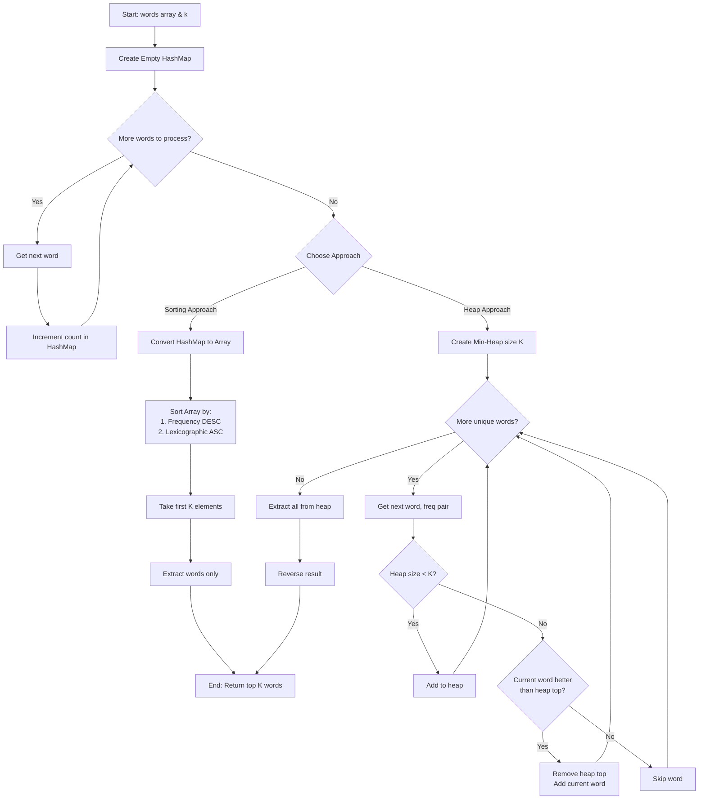

# 692. Top K Frequent Words - Complete Learning Guide

## 1. Problem Understanding 🎯

**In Simple Terms:**
Imagine you have a bag of words (possibly with duplicates). Your task is to:

1. Count how many times each unique word appears
2. Find the K words that appear most frequently
3. If two words appear the same number of times, arrange them alphabetically

**Example Visualization:**

```Javascrip
Input: ["i","love","leetcode","i","love","coding"], k = 2

Step 1 - Count:
"i" → 2 times
"love" → 2 times
"leetcode" → 1 time
"coding" → 1 time

Step 2 - Rank by frequency (if tied, alphabetically):
1. "i" (frequency: 2)
2. "love" (frequency: 2)
3. "coding" (frequency: 1)
4. "leetcode" (frequency: 1)

Step 3 - Return top K=2:
["i", "love"]
```

**Edge Cases to Consider:**

- All words have the same frequency → purely alphabetical sorting
- K equals the number of unique words → return all words sorted
- Single word repeated multiple times
- K = 1 (minimum case)

---

## 2. Constraints Analysis 🔍

Let's decode what the constraints tell us:

| Constraint                  | What It Tells Us           | Impact on Solution                           |
|-----------------------------|----------------------------|----------------------------------------------|
| `1 <= words.length <= 500`  | Small input size           | Can use O(n log n) sorting approaches safely |
| `1 <= words[i].length <= 10`| Short strings              | String comparison is cheap                   |
| `words[i]` = lowercase only | No case-sensitivity issues | Simpler comparison logic                     |
| `k <= unique words`         | Always valid               | No need to handle k > unique words           |

**Key Insight:** With max 500 words, even a simple O(n log n) solution is perfectly acceptable. The follow-up asks for O(n log k) optimization, which uses a min-heap approach.

---

## 3. Keyword Highlighting 🔑

**Critical Keywords that Signal Solution Approach:**

- **"Top K"** → Immediately think: **Heap/Priority Queue** or **QuickSelect**
- **"Most Frequent"** → Need **Frequency Counting** (HashMap/Object)
- **"Sorted by frequency"** → **Custom Comparator** required
- **"Lexicographical order"** → **String comparison** for tie-breaking
- **"O(n log k)"** (follow-up) → **Min-Heap of size K** is the optimal approach

**Pattern Recognition:**
When you see "Top K" + "Frequency" → This is a **Top K Elements** pattern, which is extremely common in interviews.

---

## 4. Breaking Down Into Manageable Parts 🧩

Let's decompose this problem:

```Javascrip
Main Problem: Get K most frequent words (sorted)
    │
    ├─── Sub-problem 1: Count word frequencies
    │    └─── Solution: HashMap/Dictionary
    │
    ├─── Sub-problem 2: Identify top K frequent
    │    ├─── Option A: Sort all words by frequency
    │    └─── Option B: Use min-heap of size K
    │
    └─── Sub-problem 3: Handle tie-breaking
         └─── Solution: Custom comparator (frequency desc, then lexicographic asc)
```

**Mental Model:**

1. **Count** (HashMap)
2. **Rank** (Heap or Sort)
3. **Extract** (Top K results)

---

## 5. Pattern Identification 📋

**Primary Pattern:
Top K Elements**

This pattern appears when you need to find:

- K largest/smallest elements
- K most/least frequent elements
- K closest points to origin
- K strongest/weakest values

**Pattern Signature:**

```Javascrip
Input: Collection + Integer K
Output: K special elements based on some criterion
Technique: Heap (Priority Queue) or Sorting
```

**Secondary Pattern:
Hash Map for Counting**

Almost always paired with frequency-based Top K problems.

---

## 6. Step-by-Step Approach 🚀

### Approach 1: Sort-Based (Simple & Intuitive)

**Algorithm:**

```Javascrip
1. Create a frequency map
   - Iterate through words array
   - For each word, increment its count in HashMap

2. Extract unique words with their frequencies
   - Convert HashMap to array of [word, frequency] pairs

3. Sort the array using custom comparator
   - Primary sort: by frequency (descending)
   - Secondary sort: by lexicographical order (ascending)

4. Extract first K elements
   - Slice the sorted array to get top K
   - Return just the words (not frequencies)
```

**Time Complexity:** O(n log n) where n = unique words
**Space Complexity:** O(n)

---

### Approach 2: Min-Heap (Optimal - Follows Up)

**Algorithm:**

```Javascrip
1. Create a frequency map (same as approach 1)

2. Use a min-heap of size K
   - Heap ordered by: frequency (ascending), then lexicographic (descending)
   - Why? We want to easily remove the "least qualified" element
   
3. Process each unique word:
   - If heap size < K: add word to heap
   - If heap size = K:
     - Compare current word with heap top (minimum element)
     - If current word is "better", remove heap top and add current word

4. Extract all elements from heap and reverse
   - Heap gives us elements in ascending order
   - We need descending order, so reverse
```

**Time Complexity:** O(n log k) where n = unique words
**Space Complexity:** O(n) for frequency map + O(k) for heap = O(n)

**Why This is Better:**

- When k << n (k is much smaller than n), log k is much smaller than log n
- Example: 10,000 unique words, k=10 → log 10 vs log 10,000

---

## 7. Code Implementation 💻

### JavaScript Solution

#### Approach 1: Sorting (Simpler)

```javascript
/**
 * @param {string[]} words
 * @param {number} k
 * @return {string[]}
 */
var topKFrequent = function(words, k) {
    // Step 1: Build frequency map
    const freqMap = new Map();
    for (const word of words) {
        freqMap.set(word, (freqMap.get(word) || 0) + 1);
    }
    
    // Step 2: Convert to array of [word, frequency] pairs
    const wordFreqPairs = Array.from(freqMap.entries());
    
    // Step 3: Sort with custom comparator
    wordFreqPairs.sort((a, b) => {
        // a[0] = word, a[1] = frequency
        if (a[1] !== b[1]) {
            // Different frequencies: higher frequency comes first
            return b[1] - a[1];
        } else {
            // Same frequency: lexicographical order
            return a[0].localeCompare(b[0]);
        }
    });
    
    // Step 4: Extract top K words
    return wordFreqPairs.slice(0, k).map(pair => pair[0]);
};
```

#### Approach 2: Min-Heap (Optimal)

```javascript
/**
 * Min-Heap implementation for Top K Frequent Words
 * Heap maintains K elements, removes the "worst" when exceeding size
 */
class MinHeap {
    constructor() {
        this.heap = [];
    }
    
    // Custom comparator: returns true if a should be above b
    compare(a, b) {
        // a = [word, frequency]
        if (a[1] !== b[1]) {
            // Lower frequency should be at top (min-heap by frequency)
            return a[1] < b[1];
        }
        // Same frequency: larger lexicographically should be at top
        // (we want to remove larger words when tied)
        return a[0] > b[0];
    }
    
    push(val) {
        this.heap.push(val);
        this.bubbleUp(this.heap.length - 1);
    }
    
    pop() {
        if (this.heap.length === 0) return null;
        if (this.heap.length === 1) return this.heap.pop();
        
        const top = this.heap[0];
        this.heap[0] = this.heap.pop();
        this.bubbleDown(0);
        return top;
    }
    
    peek() {
        return this.heap[0];
    }
    
    size() {
        return this.heap.length;
    }
    
    bubbleUp(index) {
        while (index > 0) {
            const parentIndex = Math.floor((index - 1) / 2);
            if (!this.compare(this.heap[index], this.heap[parentIndex])) break;
            
            [this.heap[index], this.heap[parentIndex]] = 
            [this.heap[parentIndex], this.heap[index]];
            index = parentIndex;
        }
    }
    
    bubbleDown(index) {
        while (true) {
            let smallest = index;
            const left = 2 * index + 1;
            const right = 2 * index + 2;
            
            if (left < this.heap.length && 
                this.compare(this.heap[left], this.heap[smallest])) {
                smallest = left;
            }
            if (right < this.heap.length && 
                this.compare(this.heap[right], this.heap[smallest])) {
                smallest = right;
            }
            
            if (smallest === index) break;
            
            [this.heap[index], this.heap[smallest]] = 
            [this.heap[smallest], this.heap[index]];
            index = smallest;
        }
    }
}

var topKFrequent = function(words, k) {
    // Step 1: Build frequency map
    const freqMap = new Map();
    for (const word of words) {
        freqMap.set(word, (freqMap.get(word) || 0) + 1);
    }
    
    // Step 2: Use min-heap to maintain top K
    const minHeap = new MinHeap();
    
    for (const [word, freq] of freqMap.entries()) {
        minHeap.push([word, freq]);
        
        // If heap exceeds size K, remove the minimum
        if (minHeap.size() > k) {
            minHeap.pop();
        }
    }
    
    // Step 3: Extract all elements and reverse
    const result = [];
    while (minHeap.size() > 0) {
        result.push(minHeap.pop()[0]);
    }
    
    return result.reverse();
};
```

---

### Java Solution

#### Approach 1: Sorting

```java
class Solution {
    public List<String> topKFrequent(String[] words, int k) {
        // Step 1: Build frequency map
        Map<String, Integer> freqMap = new HashMap<>();
        for (String word : words) {
            freqMap.put(word, freqMap.getOrDefault(word, 0) + 1);
        }
        
        // Step 2: Convert to list of words
        List<String> candidates = new ArrayList<>(freqMap.keySet());
        
        // Step 3: Sort with custom comparator
        Collections.sort(candidates, (w1, w2) -> {
            int freq1 = freqMap.get(w1);
            int freq2 = freqMap.get(w2);
            
            if (freq1 != freq2) {
                // Higher frequency first
                return freq2 - freq1;
            } else {
                // Lexicographical order
                return w1.compareTo(w2);
            }
        });
        
        // Step 4: Return top K
        return candidates.subList(0, k);
    }
}
```

#### Approach 2: Priority Queue (Min-Heap)

```java
class Solution {
    public List<String> topKFrequent(String[] words, int k) {
        // Step 1: Build frequency map
        Map<String, Integer> freqMap = new HashMap<>();
        for (String word : words) {
            freqMap.put(word, freqMap.getOrDefault(word, 0) + 1);
        }
        
        // Step 2: Min-heap with custom comparator
        // Keep the "worst" K elements at the top for easy removal
        PriorityQueue<String> minHeap = new PriorityQueue<>(
            (w1, w2) -> {
                int freq1 = freqMap.get(w1);
                int freq2 = freqMap.get(w2);
                
                if (freq1 != freq2) {
                    // Min-heap: lower frequency at top
                    return freq1 - freq2;
                } else {
                    // Reverse lexicographical: larger words at top
                    return w2.compareTo(w1);
                }
            }
        );
        
        // Step 3: Process each word
        for (String word : freqMap.keySet()) {
            minHeap.offer(word);
            if (minHeap.size() > k) {
                minHeap.poll(); // Remove the "worst" element
            }
        }
        
        // Step 4: Extract and reverse
        List<String> result = new ArrayList<>();
        while (!minHeap.isEmpty()) {
            result.add(minHeap.poll());
        }
        Collections.reverse(result);
        
        return result;
    }
}
```

---

## 8. Complexity Analysis 📊

### Approach 1

Sorting

**Time Complexity:**

- Counting frequencies: O(N) where N = total number of words
- Sorting unique words: O(M log M) where M = number of unique words
- Extracting top K: O(K)
- **Total: O(N + M log M)**
- Worst case: M = N, so O(N log N)

**Space Complexity:**

- Frequency map: O(M)
- Array for sorting: O(M)
- **Total: O(M) ≈ O(N) in worst case**

---

### Approach 2: Min-Heap

**Time Complexity:**

- Counting frequencies: O(N)
- Building heap: O(M log K)
  - For each of M unique words, we do O(log K) heap operation
- Extracting K elements: O(K log K)
- **Total: O(N + M log K)**
- When K << M, this is significantly better than O(N log N)

**Space Complexity:**

- Frequency map: O(M)
- Heap: O(K)
- **Total: O(M) = O(N) for frequency map**
- Heap space is O(K) which is typically smaller

**Comparison:**

```Javascrip
Example: N=10000, M=1000, K=10

Sorting: 10000 + 1000*log(1000) ≈ 10000 + 10000 = 20000 operations
Heap:    10000 + 1000*log(10)   ≈ 10000 + 3300  = 13300 operations

Heap is ~33% faster!
```

---

## 9. Alternative Solutions 🔄

### Alternative 1: Bucket Sort (When Frequencies Are Limited)

If maximum frequency is F and F << N, we can use bucket sort:

```javascript
var topKFrequent = function(words, k) {
    // Step 1: Count frequencies
    const freqMap = new Map();
    let maxFreq = 0;
    for (const word of words) {
        const count = (freqMap.get(word) || 0) + 1;
        freqMap.set(word, count);
        maxFreq = Math.max(maxFreq, count);
    }
    
    // Step 2: Create buckets (index = frequency)
    const buckets = Array.from({ length: maxFreq + 1 }, () => []);
    for (const [word, freq] of freqMap.entries()) {
        buckets[freq].push(word);
    }
    
    // Step 3: Sort words within each bucket
    for (let bucket of buckets) {
        bucket.sort();
    }
    
    // Step 4: Collect top K from highest frequency buckets
    const result = [];
    for (let freq = maxFreq; freq > 0 && result.length < k; freq--) {
        for (const word of buckets[freq]) {
            result.push(word);
            if (result.length === k) break;
        }
    }
    
    return result;
};
```

**Time Complexity:** O(N + M log M) where M = unique words per bucket
**When to use:** When maxFreq is small (e.g., < 100)

---

### Alternative 2: QuickSelect (If We Don't Need Exact Sorting)

Not applicable here since we need exact sorting by frequency and lexicographical order.

---

## 10. Practice Recommendations 📚

### Similar "Top K" Pattern Problems

1. **347. Top K Frequent Elements** ⭐
   - Same pattern, but with integers instead of strings
   - No lexicographical sorting needed

2. **215. Kth Largest Element in an Array** ⭐⭐
   - Core "Top K" problem
   - Learn QuickSelect optimization

3. **373. Find K Pairs with Smallest Sums** ⭐⭐⭐
   - Advanced heap usage
   - Multiple criteria optimization

4. **451. Sort Characters By Frequency** ⭐⭐
   - Frequency counting + custom sorting
   - Very similar to this problem

5. **973. K Closest Points to Origin** ⭐⭐
   - Top K with distance calculation
   - Good heap practice

### Hash Map + Sorting Pattern

1. **1636. Sort Array by Increasing Frequency** ⭐
   - Frequency counting with custom sorting

2. **1387. Sort Integers by The Power Value** ⭐⭐
   - Custom metric calculation + sorting

### Practice Strategy

1. Start with #347 (easier version)
2. Then solve this problem (#692)
3. Move to #451 (character frequency)
4. Challenge yourself with #373

---

## 11. Flowchart Design 🎨



---

## Key Takeaways 🎓

1. **"Top K"** keyword → Think Heap or Sorting immediately
2. **Frequency counting** → HashMap is your friend
3. **Custom sorting** → Understand comparator logic deeply
4. **Trade-offs:**
   - Sorting: Simpler code, O(N log N)
   - Heap: Better complexity O(N log K), more complex code
5. **Interview tip:** Start with sorting approach, then mention heap optimization

**The Power of Pattern Recognition:**
Once you master the "Top K Elements" pattern, you can solve dozens of similar problems by just adjusting the comparison logic!

Good luck with your practice! 🚀
