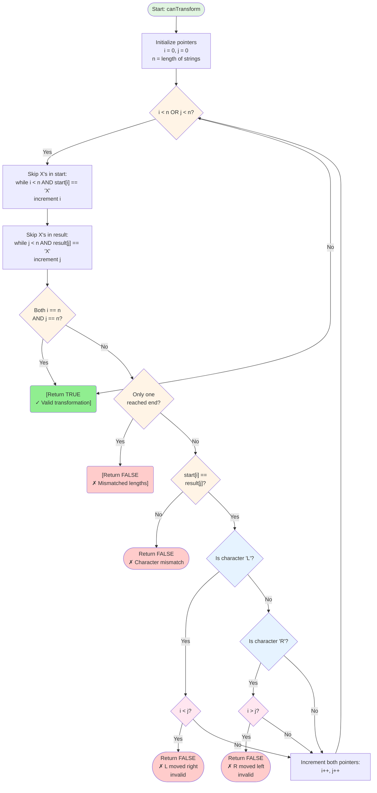

# *Swap Adjacent in LR String*

```mermaid
flowchart TD
    Start([Start: canTransform]) --> Init[Initialize pointers<br/>i = 0, j = 0<br/>n = length of strings]

    Init --> MainLoop{i < n OR j < n?}
    
    MainLoop -->|Yes| SkipStartX["Skip X's in start:<br/>while i < n AND start[i] == 'X'<br/>increment i"]
    
    SkipStartX --> SkipResultX["Skip X's in result:<br/>while j < n AND result[j] == 'X'<br/>increment j"]
    
    SkipResultX --> BothEnd{Both i == n<br/>AND j == n?}
    
    BothEnd -->|Yes| ReturnTrue("[Return TRUE<br/>✓ Valid transformation]")
    
    BothEnd -->|No| OneEnd{Only one<br/>reached end?}
    
    OneEnd -->|Yes| ReturnFalse1("[Return FALSE<br/>✗ Mismatched lengths]")
    
    OneEnd -->|No| CharMatch{"start[i] ==<br/>result[j]?"}
    
    CharMatch -->|No| ReturnFalse2([Return FALSE<br/>✗ Character mismatch])
    
    CharMatch -->|Yes| CheckL{Is character 'L'?}
    
    CheckL -->|Yes| LConstraint{i < j?}
    
    LConstraint -->|Yes| ReturnFalse3([Return FALSE<br/>✗ L moved right<br/>invalid])
    
    LConstraint -->|No| IncrementBoth[Increment both pointers:<br/>i++, j++]
    
    CheckL -->|No| CheckR{Is character 'R'?}
    
    CheckR -->|Yes| RConstraint{i > j?}
    
    RConstraint -->|Yes| ReturnFalse4([Return FALSE<br/>✗ R moved left<br/>invalid])
    
    RConstraint -->|No| IncrementBoth
    
    CheckR -->|No| IncrementBoth
    
    IncrementBoth --> MainLoop
    
    MainLoop -->|No| ReturnTrue
    
    style Start fill:#e1f5e1
    style ReturnTrue fill:#90ee90
    style ReturnFalse1 fill:#ffcccb
    style ReturnFalse2 fill:#ffcccb
    style ReturnFalse3 fill:#ffcccb
    style ReturnFalse4 fill:#ffcccb
    style MainLoop fill:#fff4e6
    style BothEnd fill:#fff4e6
    style OneEnd fill:#fff4e6
    style CharMatch fill:#fff4e6
    style CheckL fill:#e6f3ff
    style CheckR fill:#e6f3ff
    style LConstraint fill:#ffe6f0
    style RConstraint fill:#ffe6f0
```
