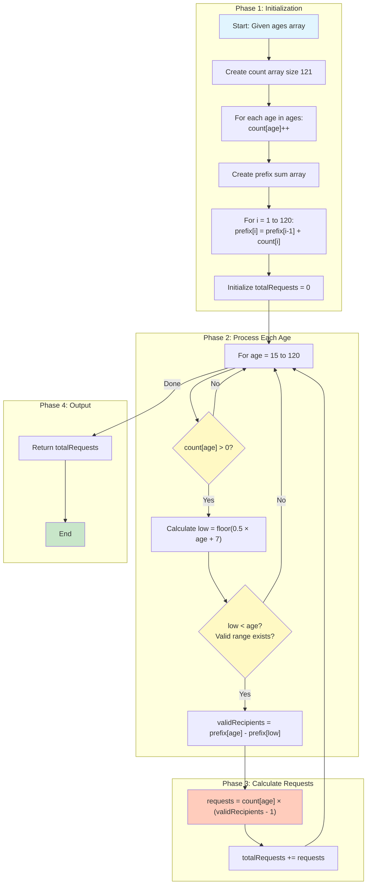

# *825. Friends Of Appropriate Ages Flowchat*

```mermaid
flowchart TD
    subgraph INIT["Phase 1: Initialization"]
        A[Start: Given ages array] --> B[Create count array size 121]
        B --> C["For each age in ages:<br/>count[age]++"]
        C --> D[Create prefix sum array]
        D --> E["For i = 1 to 120:<br/>prefix[i] = prefix[i-1] + count[i]"]
        E --> F["Initialize totalRequests = 0"]
    end

    subgraph PROCESS["Phase 2: Process Each Age"]
        F --> G["For age = 15 to 120"]
        G --> H{"count[age] > 0?"}
        H -->|No| G
        H -->|Yes| I["Calculate low = floor(0.5 × age + 7)"]
        I --> J{"low < age?<br/>Valid range exists?"}
        J -->|No| G
        J -->|Yes| K["validRecipients = prefix[age] - prefix[low]"]
    end

    subgraph CALC["Phase 3: Calculate Requests"]
        K --> L["requests = count[age] × (validRecipients - 1)"]
        L --> M["totalRequests += requests"]
        M --> G
    end

    subgraph OUTPUT["Phase 4: Output"]
        G -->|Done| N[Return totalRequests]
        N --> O[End]
    end

    style A fill:#e1f5fe
    style O fill:#c8e6c9
    style H fill:#fff9c4
    style J fill:#fff9c4
    style L fill:#ffccbc
```
