# LeetCode 973: K Closest Points to Origin - Complete Tutorial

Let me guide you through this problem using first-principles thinking and help you build a deep understanding of the patterns involved.

---

## 1. Problem Understanding

**In Simple Terms:**

Imagine you're standing at the origin (0,0) on a 2D map. There are several points scattered around you. Your task is to identify the K points that are closest to where you're standing.

**Key Points:**

- We measure "closeness" using Euclidean distance: √(x² + y²)
- We need exactly K points (not more, not less)
- The order of output doesn't matter
- We're guaranteed K will be valid (K ≤ total points)

**Edge Cases to Consider:**

- K = 1 (only need the single closest point)
- K = points.length (need all points)
- Points with same distance (handled by "any order" clause)
- Points at the origin itself (distance = 0)

---

## 2. Constraints Analysis

Let's analyze what the constraints tell us:

```Javascript
1 <= k <= points.length <= 10⁴
-10⁴ <= xi, yi <= 10⁴
```

**What this reveals:**

1. **Scale (10⁴ points):**
   - O(n²) solutions might work but could be tight
   - O(n log n) is very safe
   - O(n) would be optimal

2. **K always valid:**
   - No need to check if K > array length
   - Simplifies edge case handling

3. **Coordinate range (-10⁴ to 10⁴):**
   - Maximum distance² = (10⁴)² + (10⁴)² = 2 × 10⁸
   - Fits comfortably in int/number range
   - No overflow concerns

4. **Space considerations:**
   - With 10⁴ points, O(n) space is acceptable
   - Even O(n log n) space would be fine

---

## 3. Keyword Highlighting

**Critical Keywords & What They Tell Us:**

| Keyword                  | Pattern Signal                      | Why It Matters             |
|--------------------------|-------------------------------------|----------------------------|
| **"K closest"**          | Selection problem, Heap/QuickSelect | We don't need full sorting |
| **"return K points"**    | Partial selection                   | Top-K pattern              |
| **"any order"**          | No sorting required on output       | Saves time complexity      |
| **"Euclidean distance"** | Need comparison metric              | Can optimize (avoid sqrt)  |
| **"guaranteed unique"**  | No tie-breaking logic needed        | Simplifies implementation  |

**Pattern Recognition Trigger:**

- "K largest/smallest/closest" → **Top-K Pattern** → Heap or QuickSelect

---

## 4. Breaking Down The Problem

Let's decompose this into smaller subproblems:

**Subproblem 1:
Calculate Distance**

- Input: Point [x, y]
- Output: Distance value
- Key insight: Can we avoid expensive sqrt operation?

**Subproblem 2:
Compare Points**

- Input: Two points
- Output: Which is closer?
- Key insight: If a² < b², then a < b (sqrt is monotonic)

**Subproblem 3:
Find K Closest**

- Input: All points, K value
- Output: K points with smallest distances
- This is the core Top-K selection problem

**Subproblem 4:
Format Output**

- Return the selected points (trivial step)

---

## 5. Pattern Identification

**Primary Pattern:
Top-K Selection**

This problem belongs to the **Selection/Partial Sorting** family. We have three main approaches:

### Approach A: Full Sort

- Sort all points by distance, take first K
- Simple but does more work than needed

### Approach B: Max Heap (Optimal for K << N)

- Maintain a heap of K smallest elements
- Excellent when K is small

### Approach C: QuickSelect (Optimal average case)

- Partition-based selection (like QuickSort)
- O(n) average time complexity

**When to use each:**

- **Heap:** K is small (K ≤ n/3), need online processing
- **QuickSelect:** Best average performance, one-time query
- **Sort:** K is close to n, need sorted output anyway

---

## 6. Step-by-Step Approach

### Approach 1: Max Heap (Most Interview-Friendly)

**Rationale:** We want to maintain the K closest points. A max heap lets us efficiently:

1. Keep track of the K smallest distances
2. Remove the largest (farthest) when we exceed K elements

**Algorithm Steps:**

```Javascript
1. Create a max heap (priority queue) based on distance
2. For each point:
   a. Calculate distance² (no sqrt needed!)
   b. Add point to heap
   c. If heap size > K, remove the maximum (farthest point)
3. Return all points remaining in heap
```

**Why Max Heap, not Min Heap?**

- We want to quickly remove the **farthest** point when heap exceeds K
- Max heap gives us O(log K) removal of the maximum element

**Visual Example:**

```Javascript
Points: [[1,3], [-2,2], [3,3]], K=2

Step 1: Add [1,3], dist²=10
Heap: [10]

Step 2: Add [-2,2], dist²=8
Heap: [10, 8]

Step 3: Add [3,3], dist²=18
Heap: [18, 10, 8]
Size > K, remove max (18)
Heap: [10, 8]

Result: [[1,3], [-2,2]]
```

---

## 7. Code Implementation

### JavaScript Solution

```javascript
/**
 * Max Heap Approach - O(n log k) time, O(k) space
 * @param {number[][]} points
 * @param {number} k
 * @return {number[][]}
 */
var kClosest = function(points, k) {
    // Helper: Calculate squared distance (avoid sqrt for efficiency)
    const getDistanceSquared = ([x, y]) => x * x + y * y;
    
    // Max heap using array (JavaScript doesn't have built-in heap)
    // We'll simulate with array + manual heap operations
    const maxHeap = [];
    
    // Helper: Insert into max heap
    const insert = (point) => {
        maxHeap.push(point);
        bubbleUp(maxHeap.length - 1);
    };
    
    // Helper: Bubble up to maintain heap property
    const bubbleUp = (index) => {
        while (index > 0) {
            const parentIndex = Math.floor((index - 1) / 2);
            if (getDistanceSquared(maxHeap[index]) <= 
                getDistanceSquared(maxHeap[parentIndex])) break;
            
            [maxHeap[index], maxHeap[parentIndex]] = 
                [maxHeap[parentIndex], maxHeap[index]];
            index = parentIndex;
        }
    };
    
    // Helper: Remove max (root)
    const extractMax = () => {
        if (maxHeap.length === 0) return null;
        if (maxHeap.length === 1) return maxHeap.pop();
        
        const max = maxHeap[0];
        maxHeap[0] = maxHeap.pop();
        bubbleDown(0);
        return max;
    };
    
    // Helper: Bubble down to maintain heap property
    const bubbleDown = (index) => {
        while (true) {
            let largest = index;
            const left = 2 * index + 1;
            const right = 2 * index + 2;
            
            if (left < maxHeap.length && 
                getDistanceSquared(maxHeap[left]) > 
                getDistanceSquared(maxHeap[largest])) {
                largest = left;
            }
            
            if (right < maxHeap.length && 
                getDistanceSquared(maxHeap[right]) > 
                getDistanceSquared(maxHeap[largest])) {
                largest = right;
            }
            
            if (largest === index) break;
            
            [maxHeap[index], maxHeap[largest]] = 
                [maxHeap[largest], maxHeap[index]];
            index = largest;
        }
    };
    
    // Main algorithm
    for (const point of points) {
        insert(point);
        
        // If heap exceeds K, remove the farthest point
        if (maxHeap.length > k) {
            extractMax();
        }
    }
    
    return maxHeap;
};

// Alternative: Simple Sort Approach (easier to implement)
var kClosestSort = function(points, k) {
    // Sort by distance, take first K
    return points
        .sort((a, b) => 
            (a[0]**2 + a[1]**2) - (b[0]**2 + b[1]**2))
        .slice(0, k);
};
```

### Java Solution

```java
class Solution {
    /**
     * Max Heap Approach using PriorityQueue
     * Time: O(n log k), Space: O(k)
     */
    public int[][] kClosest(int[][] points, int k) {
        // Max heap comparing by distance squared (descending order)
        PriorityQueue<int[]> maxHeap = new PriorityQueue<>(
            (a, b) -> (b[0]*b[0] + b[1]*b[1]) - (a[0]*a[0] + a[1]*a[1])
        );
        
        // Process each point
        for (int[] point : points) {
            maxHeap.offer(point);
            
            // Maintain heap size of K
            if (maxHeap.size() > k) {
                maxHeap.poll(); // Remove farthest point
            }
        }
        
        // Convert heap to array
        int[][] result = new int[k][2];
        for (int i = 0; i < k; i++) {
            result[i] = maxHeap.poll();
        }
        
        return result;
    }
    
    /**
     * Alternative: Simple Sort Approach
     * Time: O(n log n), Space: O(1) or O(n) depending on sort
     */
    public int[][] kClosestSort(int[][] points, int k) {
        // Sort by distance squared
        Arrays.sort(points, (a, b) -> 
            (a[0]*a[0] + a[1]*a[1]) - (b[0]*b[0] + b[1]*b[1])
        );
        
        // Return first K points
        return Arrays.copyOfRange(points, 0, k);
    }
    
    /**
     * Advanced: QuickSelect Approach
     * Time: O(n) average, O(n²) worst, Space: O(1)
     */
    public int[][] kClosestQuickSelect(int[][] points, int k) {
        quickSelect(points, 0, points.length - 1, k);
        return Arrays.copyOfRange(points, 0, k);
    }
    
    private void quickSelect(int[][] points, int left, int right, int k) {
        if (left >= right) return;
        
        int pivotIndex = partition(points, left, right);
        
        if (pivotIndex == k) {
            return; // Found exact K elements
        } else if (pivotIndex < k) {
            quickSelect(points, pivotIndex + 1, right, k);
        } else {
            quickSelect(points, left, pivotIndex - 1, k);
        }
    }
    
    private int partition(int[][] points, int left, int right) {
        int[] pivot = points[right];
        int pivotDist = pivot[0]*pivot[0] + pivot[1]*pivot[1];
        int i = left;
        
        for (int j = left; j < right; j++) {
            int currDist = points[j][0]*points[j][0] + points[j][1]*points[j][1];
            if (currDist < pivotDist) {
                swap(points, i, j);
                i++;
            }
        }
        swap(points, i, right);
        return i;
    }
    
    private void swap(int[][] points, int i, int j) {
        int[] temp = points[i];
        points[i] = points[j];
        points[j] = temp;
    }
}
```

---

## 8. Complexity Analysis

### Approach 1: Max Heap

**Time Complexity:
O(n log k)**

- Process n points: O(n)
- Each insertion/deletion in heap of size k: O(log k)
- Total: O(n log k)

**Space Complexity:
O(k)**

- Heap maintains at most k elements
- Result array: O(k)

**When K = n:** O(n log n) time

### Approach 2: Simple Sort

**Time Complexity:
O(n log n)**

- Sorting all points: O(n log n)
- Slicing first k: O(k)

**Space Complexity:
O(1) to O(n)**

- Depends on sort implementation
- JavaScript sort is typically in-place

### Approach 3: QuickSelect

**Time Complexity:
O(n) average, O(n²) worst**

- Average case: partition eliminates half each time
- Worst case: bad pivot choices

**Space Complexity:
O(1)**

- In-place partitioning

### **Comparison Table:**

| Approach    | Time       | Space | Best When                 |
|-------------|------------|-------|---------------------------|
| Max Heap    | O(n log k) | O(k)  | K << n (small K)          |
| Sort        | O(n log n) | O(1)  | K ≈ n, need simplicity    |
| QuickSelect | O(n) avg   | O(1)  | Large datasets, one query |

---

## 9. Alternative Solutions & Optimizations

### Optimization 1: Avoid Square Root

```javascript
// Instead of Math.sqrt(x² + y²)
const distance = Math.sqrt(x*x + y*y); // ❌ Slower

// Use squared distance for comparison
const distSquared = x*x + y*y; // ✅ Faster
```

**Why?** sqrt is monotonic: if a² < b², then a < b

### Optimization 2: Early Termination (when applicable)

If you need to check if a point is among K closest:

```javascript
// Build heap of K closest
// Then check if new point's distance < heap max
if (newDistSquared < maxHeap[0].distSquared) {
    // This point IS in top K
}
```

### Optimization 3: Bucket Sort (when distances are bounded)

If distances fall in a known range, bucket sort can achieve O(n):

```javascript
// Group points by distance ranges
// Find K smallest by traversing buckets
```

### Alternative: Two-Pass Sort (when K is large)

```javascript
// If K > n/2, it's faster to find (n-K) farthest and remove them
if (k > points.length / 2) {
    // Find n-k farthest points to exclude
}
```

---

## 10. Practice Recommendations

**Same Pattern (Top-K Selection):**

1. **LC 215 - Kth Largest Element in Array**
   - Direct Top-K problem
   - Practice heap vs quickselect

2. **LC 347 - Top K Frequent Elements**
   - Top-K with frequency counting
   - Bucket sort optimization

3. **LC 658 - Find K Closest Elements**
   - Similar but different metric (absolute difference)
   - Two-pointer optimization

4. **LC 692 - Top K Frequent Words**
   - Top-K with custom comparator
   - Heap with strings

5. **LC 703 - Kth Largest Element in Stream**
   - Online Top-K problem
   - Min heap maintenance

**Related Patterns:**

1. **LC 295 - Find Median from Data Stream**
   - Two heaps technique
   - Similar heap manipulation

2. **LC 767 - Reorganize String**
   - Max heap for greedy selection
   - Different application of heaps

3. **LC 1046 - Last Stone Weight**
   - Max heap simulation
   - Heap operations practice

**Progression Path:**

1. Start with LC 215 (simpler, 1D)
2. Then LC 973 (this problem)
3. Move to LC 347 (add frequency counting)
4. Try LC 703 (online version)
5. Challenge: LC 295 (two heaps)

---

## 11. Flowchart Design

```mermaid
flowchart TD
    Start([Start: Points Array + K]) --> Init[Initialize Max Heap<br/>Size = 0]
    Init --> Loop{For each point<br/>in points array}
    
    Loop -->|Next point| CalcDist["Calculate distance²<br/>dist² = x² + y²"]
    CalcDist --> AddHeap[Add point to<br/>max heap]
    AddHeap --> CheckSize{Heap size > K?}
    
    CheckSize -->|Yes| RemoveMax[Remove max element<br/>farthest point]
    CheckSize -->|No| Loop
    RemoveMax --> Loop
    
    Loop -->|All processed| Result[Return heap contents<br/>K closest points]
    Result --> End([End])
    
    style Start fill:#e1f5e
    style End fill:#ffe1e
    style CheckSize fill:#fff4e
    style RemoveMax fill:#f0e1f
    style CalcDist fill:#e1f0f
```



### Detailed Algorithm Flow

```mermaid
flowchart TD
    A[Input: points, k] --> B[Create empty max heap]
    B --> C{More points<br/>to process?}
    
    C -->|Yes| D[Get next point x, y]
    D --> E[Calculate dist² = x² + y²]
    E --> F[Insert point, dist² into heap]
    F --> G{heap.size > k?}
    
    G -->|Yes| H[Extract max<br/>Remove farthest point]
    G -->|No| C
    H --> C
    
    C -->|No| I[Convert heap to array]
    I --> J[Return k closest points]
    
    subgraph "Heap Operations"
        F1[Insert: Add to end] --> F2[Bubble up to<br/>maintain max heap]
        H1[Extract: Remove root] --> H2[Move last to root] --> H3[Bubble down to<br/>restore heap]
    end
    
    style A fill:#90EE9
    style J fill:#FFB6C
    style G fill:#FFE4B
```



### Complexity Analysis Visual


---

## Key Takeaways

1. **Pattern Recognition:** "K closest/largest/smallest" → Top-K → Heap or QuickSelect

2. **Optimization:** Avoid unnecessary operations (sqrt in comparisons)

3. **Trade-offs:**
   - Heap: Better for small K
   - Sort: Simpler implementation
   - QuickSelect: Best average performance

4. **Interview Tips:**
   - Start with brute force (sort)
   - Optimize to heap for better complexity
   - Mention QuickSelect for bonus points

5. **Common Mistakes:**
   - Using min heap instead of max heap
   - Forgetting to avoid sqrt
   - Not considering K = n edge case

Practice these patterns, and you'll recognize Top-K problems instantly in interviews! Would you like me to clarify any specific part or walk through a particular example in more detail?

---

## Deep Dive

Simple Sort Approach Walkthrough

Let me break down this solution line by line and trace through complete examples!

---

## 📋 Code Breakdown

```javascript
var kClosestSort = function(points, k) {
    return points
        .sort((a, b) => (a[0]**2 + a[1]**2) - (b[0]**2 + b[1]**2))
        .slice(0, k);
};
```

### Line-by-Line Analysis

```javascript
// Line 1: Function declaration
var kClosestSort = function(points, k) {
    // points: 2D array [[x1,y1], [x2,y2], ...]
    // k: number of closest points we need
```

```javascript
// Line 2: Return statement with method chaining
return points
```

- We're returning the result of chained operations
- Method chaining: `array.method1().method2()`

```javascript
// Line 3: Sort operation
.sort((a, b) => (a[0]**2 + a[1]**2) - (b[0]**2 + b[1]**2))
```

**This is the CORE of the solution!** Let me break it down:

- `sort()`: JavaScript's built-in array sort method
- `(a, b) =>`: Comparator function (arrow function)
  - `a`: First point being compared `[x1, y1]`
  - `b`: Second point being compared `[x2, y2]`

- `a[0]**2 + a[1]**2`: Distance² of point `a`
  - `a[0]` is x-coordinate → `a[0]**2` is x²
  - `a[1]` is y-coordinate → `a[1]**2` is y²
  - Sum gives us x² + y² (distance squared)

- `- (b[0]**2 + b[1]**2)`: Subtract distance² of point `b`

**How Sort Comparator Works:**

- If result is **negative** → `a` comes before `b` (a is closer)
- If result is **positive** → `b` comes before `a` (b is closer)
- If result is **zero** → order doesn't matter (equal distance)

```javascript
// Line 4: Slice operation
.slice(0, k);
```

- `slice(0, k)`: Extract first k elements
- `0`: Start index (inclusive)
- `k`: End index (exclusive)
- Returns a new array with elements from index 0 to k-1

---

## 🔍 Detailed Example Walkthrough

### Example 1: Basic Case

```javascript
points = [[1,3], [-2,2], [2,1]]
k = 2
```

**Step-by-Step Execution:**

#### Step 1: Calculate distances for each point

```javascript
Point [1,3]:   dist² = 1² + 3² = 1 + 9 = 10
Point [-2,2]:  dist² = (-2)² + 2² = 4 + 4 = 8
Point [2,1]:   dist² = 2² + 1² = 4 + 1 = 5
```

#### Step 2: Sort process

JavaScript's sort compares pairs:

**Comparison 1: [1,3] vs [-2,2]**

```javascript
a = [1,3],   b = [-2,2]
a[0]**2 + a[1]**2 = 10
b[0]**2 + b[1]**2 = 8
Result: 10 - 8 = 2 (positive)
// Positive means b comes before a
// Order so far: [[-2,2], [1,3]]
```

**Comparison 2: [2,1] vs [-2,2]**

```javascript
a = [2,1],   b = [-2,2]
a[0]**2 + a[1]**2 = 5
b[0]**2 + b[1]**2 = 8
Result: 5 - 8 = -3 (negative)
// Negative means a comes before b
// Order so far: [[2,1], [-2,2], [1,3]]
```

**Final sorted array:**

```javascript
[[2,1], [-2,2], [1,3]]
// Distances: 5,    8,      10
```

#### Step 3: Slice first k elements

```javascript
.slice(0, 2)
// Takes elements at index 0 and 1
// Result: [[2,1], [-2,2]]
```

**Final Output:** `[[2,1], [-2,2]]`

---

### Example 2: LeetCode Example

```javascript
points = [[3,3], [5,-1], [-2,4]]
k = 2
```

#### Step 1: Calculate distances

```javascript
[3,3]:   dist² = 3² + 3² = 9 + 9 = 18
[5,-1]:  dist² = 5² + (-1)² = 25 + 1 = 26
[-2,4]:  dist² = (-2)² + 4² = 4 + 16 = 20
```

#### Step 2: Visualize sorting

**Initial:** `[[3,3], [5,-1], [-2,4]]`

**After sorting (ascending by distance²):**

```javascript
[[3,3],   [-2,4],  [5,-1]]
// dist²: 18,      20,      26
```

#### Step 3: Slice

```javascript
.slice(0, 2)
// Result: [[3,3], [-2,4]]
```

**Final Output:** `[[3,3], [-2,4]]`

---

## 🎯 Visual Trace: Complete Execution

Let me show you EXACTLY what happens in memory:

### Input

```javascript
points = [[1,3], [-2,2], [2,1]]
k = 2
```

### Memory State During Execution

```Javascript
BEFORE SORT:
Index:  0      1       2
       [1,3]  [-2,2]  [2,1]
dist²:  10     8       5

⬇️  DURING SORT (internal comparisons)

Comparison rounds (simplified):
Round 1: Compare all pairs
  - [1,3] vs [-2,2]: 10-8=2 → swap needed
  - [-2,2] vs [2,1]: 8-5=3 → swap needed
  
AFTER SORT:
Index:  0      1       2
       [2,1]  [-2,2]  [1,3]
dist²:  5      8       10

⬇️  SLICE(0, 2)

Takes indices 0 and 1:
       [2,1]  [-2,2]
       
FINAL RESULT: [[2,1], [-2,2]]
```

---

## 🧮 Why Distance² Works (Math Proof)

**Question:** Why don't we need `Math.sqrt()`?

**Answer:** Because square root is a **monotonically increasing function**

### Mathematical Proof

```Javacript
If a² < b², then √(a²) < √(b²), which means a < b

Example:
Point A: dist² = 9   → dist = 3
Point B: dist² = 16  → dist = 4

Comparing with dist²:
9 < 16 ✓ (A is closer)

Comparing with dist:
3 < 4 ✓ (A is closer)

Same result! But dist² is faster to compute.
```

### Code Comparison

```javascript
// ❌ SLOWER (unnecessary sqrt)
.sort((a, b) => {
    const distA = Math.sqrt(a[0]**2 + a[1]**2);
    const distB = Math.sqrt(b[0]**2 + b[1]**2);
    return distA - distB;
})

// ✅ FASTER (same result without sqrt)
.sort((a, b) => 
    (a[0]**2 + a[1]**2) - (b[0]**2 + b[1]**2)
)
```

---

## 🎨 Visual Diagram: Sort Comparator Logic

```Javascript
Comparator: (a, b) => (a_dist² - b_dist²)

DECISION TREE:
                   Compare a and b
                         |
        ┌────────────────┼────────────────┐
        |                |                |
    Negative          Zero           Positive
    (a² < b²)       (a² = b²)        (a² > b²)
        |                |                |
    a before b      Keep order       b before a
   (a is closer)   (same distance)  (b is closer)


EXAMPLE:
a = [1,3], b = [-2,2]

a²: 1² + 3² = 10
b²: (-2)² + 2² = 8

10 - 8 = 2 (POSITIVE)
           ↓
    b comes before a
           ↓
    [-2,2] is placed before [1,3]
```

---

## 🔄 Complete Execution Flow

```mermaid
flowchart TD
    A[Input: points, k] --> B[Start: points = all points]
    B --> C[Sort: Compare pairs using<br/>distance² comparator]
    
    C --> D{For each pair a, b}
    D --> E[Calculate a_dist² = a[0]² + a[1]²]
    D --> F[Calculate b_dist² = b[0]² + b[1]²]
    
    E --> G[Compare: a_dist² - b_dist²]
    F --> G
    
    G --> H{Result?}
    H -->|Negative| I[a before b]
    H -->|Positive| J[b before a]
    H -->|Zero| K[Keep current order]
    
    I --> L[Continue sorting]
    J --> L
    K --> L
    
    L --> M{All pairs<br/>compared?}
    M -->|No| D
    M -->|Yes| N[Array is now sorted<br/>by distance ascending]
    
    N --> O[Slice: Take first k elements<br/>points.slice 0, k]
    O --> P[Return result]
    
    style A fill:#90EE90
    style P fill:#FFB6C1
    style H fill:#FFE4B5
    style N fill:#87CEEB
```

---

## 💡 Common Pitfalls & Edge Cases

### Pitfall 1: Forgetting parentheses

```javascript
// ❌ WRONG (operator precedence issue)
.sort((a, b) => a[0]**2 + a[1]**2 - b[0]**2 - b[1]**2)
// This evaluates as: (a[0]**2 + a[1]**2 - b[0]**2) - b[1]**2

// ✅ CORRECT
.sort((a, b) => (a[0]**2 + a[1]**2) - (b[0]**2 + b[1]**2))
```

### Edge Case 1: K = 1

```javascript
points = [[1,1], [2,2], [3,3]]
k = 1

// After sort: [[1,1], [2,2], [3,3]]
// After slice(0,1): [[1,1]]
```

### Edge Case 2: K = points.length

```javascript
points = [[1,1], [2,2]]
k = 2

// After sort: [[1,1], [2,2]]
// After slice(0,2): [[1,1], [2,2]] (all points)
```

### Edge Case 3: Points at origin

```javascript
points = [[0,0], [1,1]]
k = 1

// [0,0] has dist² = 0
// [1,1] has dist² = 2
// Result: [[0,0]]
```

### Edge Case 4: Negative coordinates

```javascript
points = [[-1,-1], [1,1]]
k = 1

// [-1,-1]: dist² = 1 + 1 = 2
// [1,1]:   dist² = 1 + 1 = 2
// Same distance! Either can be returned
```

---

## 📊 Performance Analysis

### Time Complexity: **O(n log n)**

**Why?**

- `.sort()`: JavaScript uses Timsort → O(n log n)
- `.slice()`: O(k) to create new array

**Total:** O(n log n) + O(k) = **O(n log n)** (dominant term)

### Space Complexity: **O(1) or O(n)**

**Depends on:**

- **Sort in-place:** O(1) auxiliary (but .sort() in JS uses O(log n) stack)
- **Slice creates new array:** O(k) for result

**Typical answer:** O(k) for output, O(log n) for sort stack

---

## 🆚 Quick Comparison: Sort vs Heap

```javascript
// For points = [[1,3], [-2,2], [2,1]], k = 2

SORT APPROACH:
Step 1: Sort entire array     → O(n log n)
Step 2: Take first k          → O(k)
Total work: Sorts ALL points even though we only need k

HEAP APPROACH:
Step 1: Process each point    → O(n)
  - For each: Insert O(log k)
  - Maintain heap of size k
Total work: Only maintains k elements at a time

WHEN SORT IS BETTER:
- Simple to implement
- k is close to n (like k = n/2)
- Code clarity over performance

WHEN HEAP IS BETTER:
- k << n (like k = 10, n = 10,000)
- Memory constrained (only store k elements)
- Better time complexity: O(n log k) vs O(n log n)
```

---

## 🎓 Key Takeaways

1. **Method Chaining:** `.sort().slice()` creates clean, readable code

2. **Comparator Function:** Return negative/positive to control sort order

3. **Optimization:** Use distance² instead of distance (avoid sqrt)

4. **Trade-off:** Simplicity (sort) vs Efficiency (heap)

5. **Interview Strategy:**
   - Start with this approach (simple to explain)
   - Then mention "we could optimize with a heap for O(n log k)"
   - Shows you understand both solutions

Does this walkthrough help clarify how the sort approach works? Would you like me to trace through another example or compare it with the heap approach in more detail?
