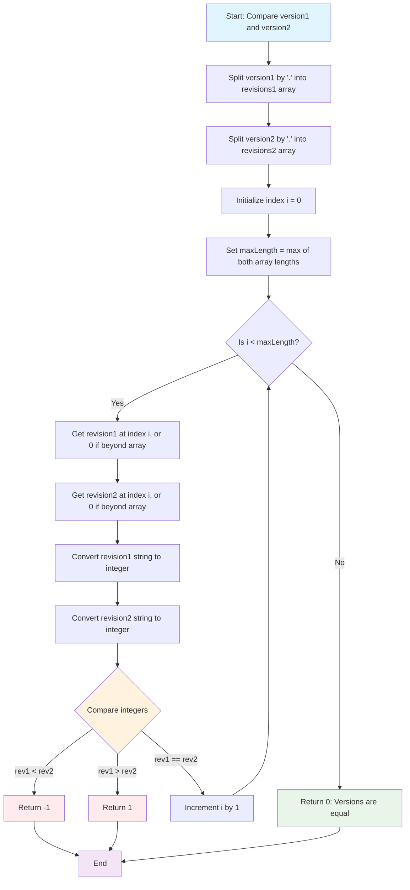

# **Version Compare Flowchart**

```mermaid
flowchart TD
    A[Start: Compare version1 and version2] --> B[Split version1 by '.' into revisions1 array]
    B --> C[Split version2 by '.' into revisions2 array]
    C --> D[Initialize index i = 0]
    D --> E[Set maxLength = max of both array lengths]
    E --> F{Is i < maxLength?}
    
    F -->|Yes| G[Get revision1 at index i, or 0 if beyond array]
    G --> H[Get revision2 at index i, or 0 if beyond array]
    H --> I[Convert revision1 string to integer]
    I --> J[Convert revision2 string to integer]
    J --> K{Compare integers}
    
    K -->|rev1 < rev2| L[Return -1]
    K -->|rev1 > rev2| M[Return 1]
    K -->|rev1 == rev2| N[Increment i by 1]
    N --> F
    
    F -->|No| O[Return 0: Versions are equal]
    
    L --> P[End]
    M --> P
    O --> P
    
    style A fill:#e1f5fe
    style P fill:#f3e5f5
    style L fill:#ffebee
    style M fill:#ffebee
    style O fill:#e8f5e8
    style K fill:#fff3e0
```
