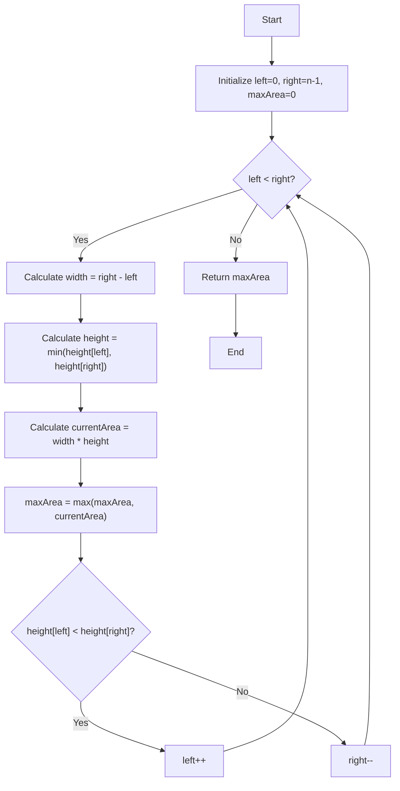

# **Container With Most Water Flowchart**

```mermaid
flowchart TD
    A[Start] --> B[Initialize left=0, right=n-1, maxArea=0]
    B --> C{left < right?}
    C -->|Yes| D[Calculate width = right - left]
    D --> E["Calculate height = min(height[left], height[right])"]
    E --> F[Calculate currentArea = width * height]
    F --> G["maxArea = max(maxArea, currentArea)"]
    G --> H{"height[left] < height[right]?"}
    H -->|Yes| I[left++]
    H -->|No| J[right--]
    I --> C
    J --> C
    C -->|No| K[Return maxArea]
    K --> L[End]
```
