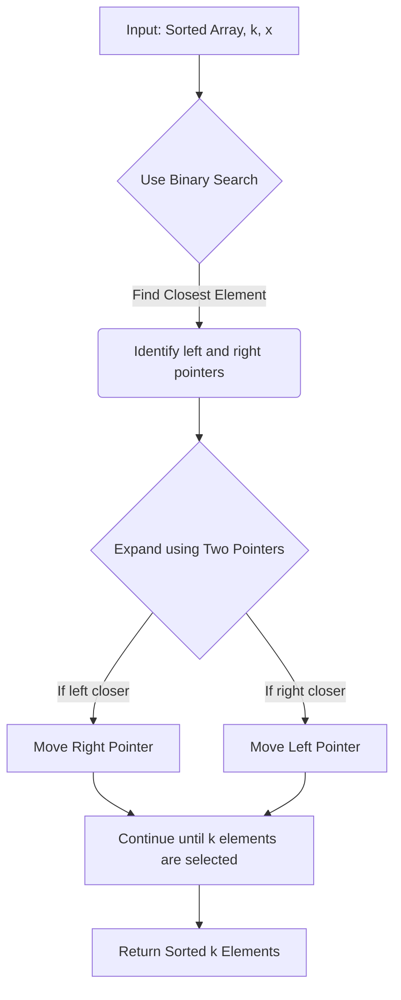

# **658. Find K Closest Elements**

## **Understanding the Problem Statement**  

We need to find `k` closest numbers to `x` in a **sorted array**. The proximity is determined first by absolute difference (`|a - x| < |b - x|`), and if there’s a tie, the smaller number comes first.  

---

## **Constraints Analysis**  

1. `1 <= k <= arr.length`:  
   - We always need to find `k` elements. No cases where `k` is invalid.  
2. `1 <= arr.length <= 10^4`:  
   - The array size is relatively large, meaning an `O(n log n)` or `O(n)` approach is preferable.  
3. `arr` is **sorted in ascending order**:  
   - This allows us to use **binary search** or **two-pointer techniques** efficiently.  
4. `-10^4 <= arr[i], x <= 10^4`:  
   - Elements can be negative, so absolute difference calculations must be handled properly.  

---

## **Breaking Down the Problem**  

1. **Find the k closest elements:** The main task is to identify the `k` elements that are closest to `x`.  
2. **Sort them in ascending order:** If they aren’t already in order, sort them.  
3. **Efficient selection:** Given the constraints, we need a method faster than brute force (`O(n log n)`).  

---

## **Pattern Identification**  

The sorted nature of `arr` suggests:

- **Binary Search** to locate the closest element efficiently.
- **Two Pointers** or **Sliding Window** to expand around the closest element.
- **Heap-based selection** for priority sorting.

---

## **Approach Discussion**

### **Approach 1: Binary Search + Two Pointers (Optimal)**

1. **Find the Closest Element using Binary Search**  
   - Locate `x` or the nearest element in `arr` using binary search (`O(log n)`).  
2. **Expand Outwards Using Two Pointers**  
   - Use two pointers to collect `k` closest numbers.  
   - This ensures `O(k)` selection efficiency.  

🔹 **Why Binary Search?**  
Since `arr` is sorted, we can quickly **find the closest element** and then expand.

🔹 **Why Two Pointers?**  
Once the closest element is found, expanding outward **avoids sorting overhead**.

---

## **Code Implementation (JavaScript)**

```javascript
var findClosestElements = function(arr, k, x) {
    let left = 0, right = arr.length - 1;

    // Step 1: Binary search to find the closest element
    while (right - left >= k) {
        if (Math.abs(arr[left] - x) <= Math.abs(arr[right] - x)) {
            right--;  // Eliminate the farther right element
        } else {
            left++;  // Eliminate the farther left element
        }
    }

    // Step 2: Extract k closest elements
    return arr.slice(left, right + 1);
};
```

---

## **Complexity Analysis**

1. **Binary Search:** `O(log n)`  
2. **Two Pointers Expansion:** `O(k)`  
3. **Final Extraction (Slicing):** `O(k)`  

⏳ **Total Time Complexity:** **O(log n + k)** (Efficient for large `n`)  
📦 **Space Complexity:** **O(1)** (No extra space used, just modifying indices)

---

## **Alternative Approaches**

### **Approach 2: Max Heap (O(n log k))**

1. Push elements into a **max heap** (priority queue) based on absolute difference from `x`.
2. Keep only the `k` closest elements in the heap.
3. Sort and return the result.

🔹 **Downside**: Heap operations are `O(log k)`, making it **slower** than binary search + two pointers.

```javascript
var findClosestElements = function(arr, k, x) {
    let maxHeap = [];
    
    for (let num of arr) {
        maxHeap.push(num);
        maxHeap.sort((a, b) => Math.abs(b - x) - Math.abs(a - x) || b - a);
        
        if (maxHeap.length > k) maxHeap.pop();
    }

    return maxHeap.sort((a, b) => a - b);
};
```

⏳ **Time Complexity:** **O(n log k)**  
📦 **Space Complexity:** **O(k)**  

---

## **Similar Problems for Practice**

1. **"Two Sum Closest"** (Leetcode #1 Variant)  
2. **"Find First and Last Position in Sorted Array"** (Leetcode #34)  
3. **"K Closest Points to Origin"** (Leetcode #973)  
4. **"Sliding Window Median"** (Leetcode #480)  

---

## **Flowchart (Mermaid)**



---

## **Final Takeaway**

✅ **Best Approach:** Binary Search + Two Pointers (`O(log n + k)`)  
✅ **Pattern:** **Binary Search + Expansion**  
✅ **Key Learning:** Efficient selection of closest elements without extra sorting.
