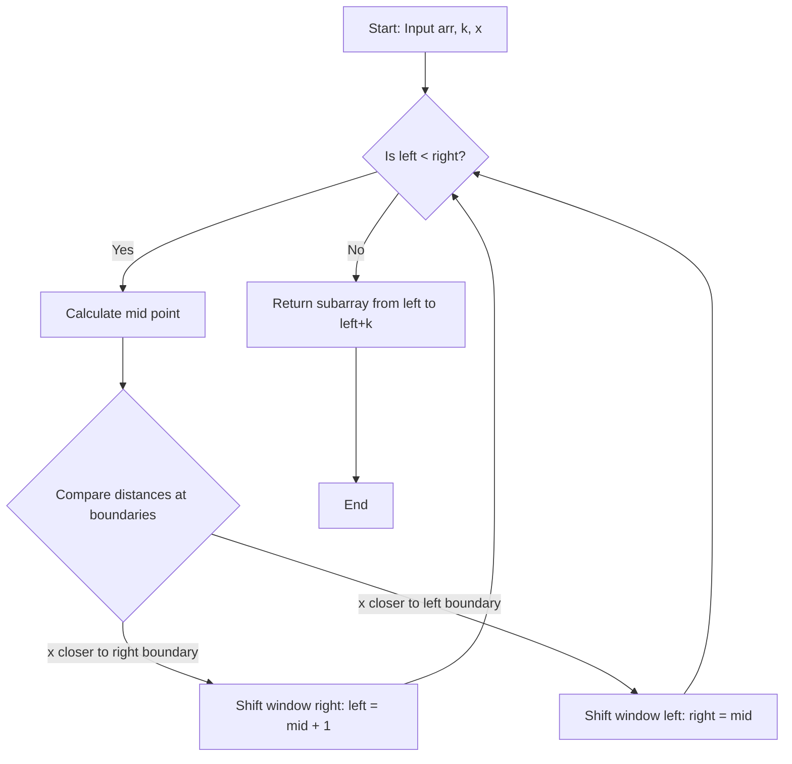

# **k-Closest-Flowchart**

```mermaid
flowchart TD
    A[Start: Input arr, k, x] --> B{Is left < right?}
    B -->|Yes| C[Calculate mid point]
    C --> D{Compare distances at boundaries}
    D -->|x closer to right boundary| E[Shift window right: left = mid + 1]
    D -->|x closer to left boundary| F[Shift window left: right = mid]
    E --> B
    F --> B
    B -->|No| G[Return subarray from left to left+k]
    G --> H[End]
```
