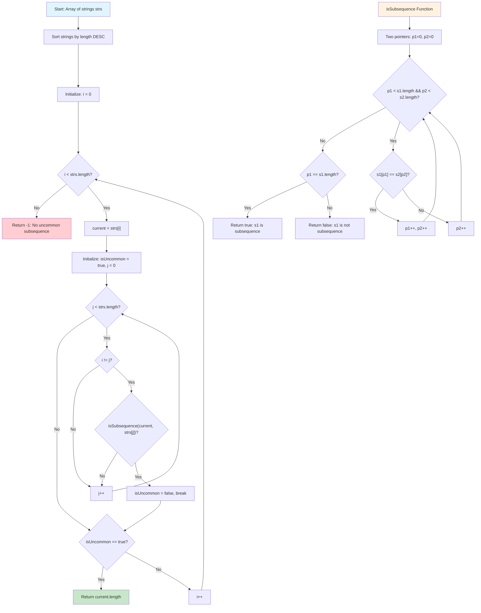

# **Longest Uncommon Subsequence II FlowChart**

```mermaid
flowchart TD
    A[Start: Array of strings strs] --> B[Sort strings by length DESC]
    B --> C[Initialize: i = 0]
    C --> D{i < strs.length?}
    D -->|No| N[Return -1: No uncommon subsequence]
    D -->|Yes| E["current = strs[i]"]
    E --> F[Initialize: isUncommon = true, j = 0]
    F --> G{j < strs.length?}
    G -->|No| L{isUncommon == true?}
    G -->|Yes| H{i != j?}
    H -->|No| I[j++]
    H -->|Yes| J{"isSubsequence(current, strs[j])?"}
    J -->|No| I
    J -->|Yes| K[isUncommon = false, break]
    K --> L
    I --> G
    L -->|Yes| M[Return current.length]
    L -->|No| O[i++]
    O --> D

    P[isSubsequence Function] --> Q[Two pointers: p1=0, p2=0]
    Q --> R{p1 < s1.length && p2 < s2.length?}
    R -->|No| V{p1 == s1.length?}
    R -->|Yes| S{"s1[p1] == s2[p2]?"}
    S -->|Yes| T[p1++, p2++]
    S -->|No| U[p2++]
    T --> R
    U --> R
    V -->|Yes| W[Return true: s1 is subsequence]
    V -->|No| X[Return false: s1 is not subsequence]
    
    style A fill:#e1f5fe
    style M fill:#c8e6c9
    style N fill:#ffcdd2
    style P fill:#fff3e0
```
