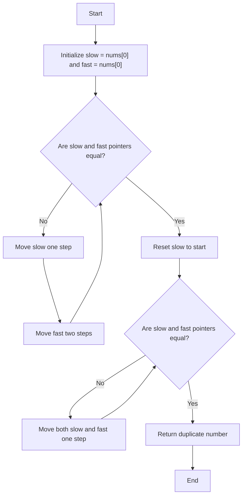

# **Duplicate Number Flowchart**

```mermaid
flowchart TD
    A[Start] --> B["Initialize slow = nums[0] and fast = nums[0]"]
    B --> C{Are slow and fast pointers equal?}
    C -->|No| D[Move slow one step]
    D --> E[Move fast two steps]
    E --> C
    C -->|Yes| F[Reset slow to start]
    F --> G{Are slow and fast pointers equal?}
    G -->|No| H[Move both slow and fast one step]
    H --> G
    G -->|Yes| I[Return duplicate number]
    I --> J[End]
```
