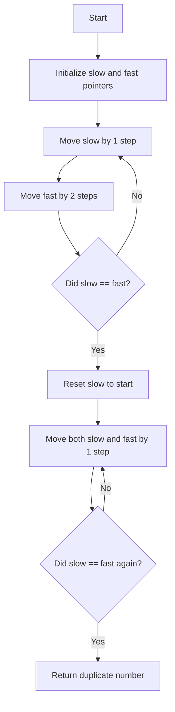

# **287. Find the Duplicate Number**

## **1. Problem Understanding**  

We are given an array of size \( n+1 \) containing integers from \( 1 \) to \( n \). Since there are \( n+1 \) numbers but only \( n \) possible distinct values, at least one number must be duplicated. Our goal is to **find this duplicate number** without modifying the array and using only **constant extra space**.

---

## **2. Constraints of the Problem**

- \( 1 \leq n \leq 10^5 \) → The array size is large, so an \( O(n^2) \) solution is inefficient.
- \( nums.length = n+1 \) → One extra number guarantees a duplicate.
- \( 1 \leq nums[i] \leq n \) → Values fit within the range.
- **No modifications allowed** → We can’t sort or change the array.
- **Constant extra space** → We can’t use additional data structures like hash maps.

---

## **3. Breaking Down the Problem**

We need an **efficient** way to find the duplicate without extra space. Let's consider:

1. **Brute force**: Nested loops to check for duplicates (too slow).
2. **Sorting the array**: Would allow detecting adjacent duplicates, but modifies the array.
3. **Using extra space**: Hash sets could track seen numbers, but violate space constraints.
4. **Mathematical approach**: Can use cycle detection (Floyd’s Tortoise and Hare).

---

## **4. Pattern Identification**

Since each number in `nums` points to an index (because values range from \( 1 \) to \( n \)), we can think of `nums` as a **linked list** where `nums[i]` represents the "next node." This hints at **Floyd’s cycle detection algorithm** (similar to detecting cycles in linked lists).

---

## **5. Approach Discussion: Floyd’s Tortoise and Hare Algorithm**

We treat the array like a linked list where:

- `nums[i]` acts as a pointer to `nums[nums[i]]`.
- The duplicate number creates a **cycle** in this "linked list."
- We use **two pointers**:
  - **Slow pointer (`slow`)** moves **one step** at a time.
  - **Fast pointer (`fast`)** moves **two steps** at a time.
  - If they meet, a cycle is detected.
  - To find the duplicate, we reset `slow` to the start and move both pointers at the same speed until they meet again.

**Why this works?**

- The cycle occurs because of the duplicate value pointing to the same index.
- Once `slow` and `fast` meet, we can determine the duplicate.

---

## **6. Code Implementation (JavaScript)**

```javascript
var findDuplicate = function(nums) {
    // Phase 1: Detect cycle using Floyd's algorithm
    let slow = nums[0];
    let fast = nums[0];

    do {
        slow = nums[slow];       // Moves one step
        fast = nums[nums[fast]]; // Moves two steps
    } while (slow !== fast);      // Loop until they meet in cycle

    // Phase 2: Find duplicate number
    slow = nums[0]; // Reset slow to start
    while (slow !== fast) {
        slow = nums[slow]; // Moves one step
        fast = nums[fast]; // Moves one step
    }

    return slow; // Duplicate number
};
```

---

## **7. Complexity Analysis**

- **Time Complexity**: \( O(n) \)  
  - Both phases run in **linear time**.
- **Space Complexity**: \( O(1) \)  
  - We use only two pointers (`slow`, `fast`), so extra space is constant.

---

## **8. Alternative Solutions**

1. **Binary Search (O(n log n) time, O(1) space)**
   - Uses **pigeonhole principle** and **counting**.
   - Counts how many numbers are \( \leq \) mid, adjusting search range.
   - Less efficient than Floyd’s cycle detection.

2. **Bitwise XOR (Modifies array, so invalid here)**
   - XORing all numbers cancels out duplicates.
   - Violates **no modification** constraint.

---

## **9. Practice Recommendations**

To strengthen Floyd’s Cycle Detection understanding:

- **142. Linked List Cycle II** 🔗(<https://leetcode.com/problems/linked-list-cycle-ii/>)
- **268. Missing Number** 🔗(<https://leetcode.com/problems/missing-number/>)
- **41. First Missing Positive** 🔗(<https://leetcode.com/problems/first-missing-positive/>)

---

### **10. Flowchart Design**

Here's a **mermaid flowchart** illustrating the logic:



---

## **End Goal Achieved**

✅ **Understood how to solve it efficiently**  
✅ **Recognized the cycle detection pattern**  
✅ **Applied Floyd’s Algorithm effectively**  
✅ **Can now apply similar logic to other problems!** 🚀
