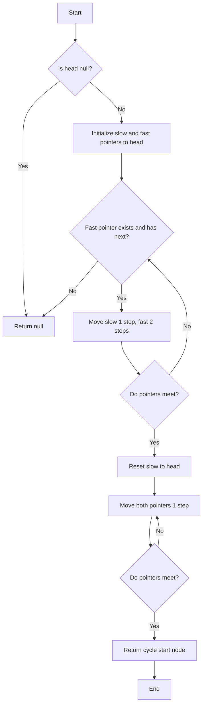

# **Cycle Detection Flowchart**

```mermaid
flowchart TD
    A[Start] --> B{Is head null?}
    B -->|Yes| C[Return null]
    B -->|No| D[Initialize slow and fast pointers to head]
    D --> E{Fast pointer exists and has next?}
    E -->|No| C
    E -->|Yes| F[Move slow 1 step, fast 2 steps]
    F --> G{Do pointers meet?}
    G -->|No| E
    G -->|Yes| H[Reset slow to head]
    H --> I[Move both pointers 1 step]
    I --> J{Do pointers meet?}
    J -->|No| I
    J -->|Yes| K[Return cycle start node]
    K --> L[End]
```
