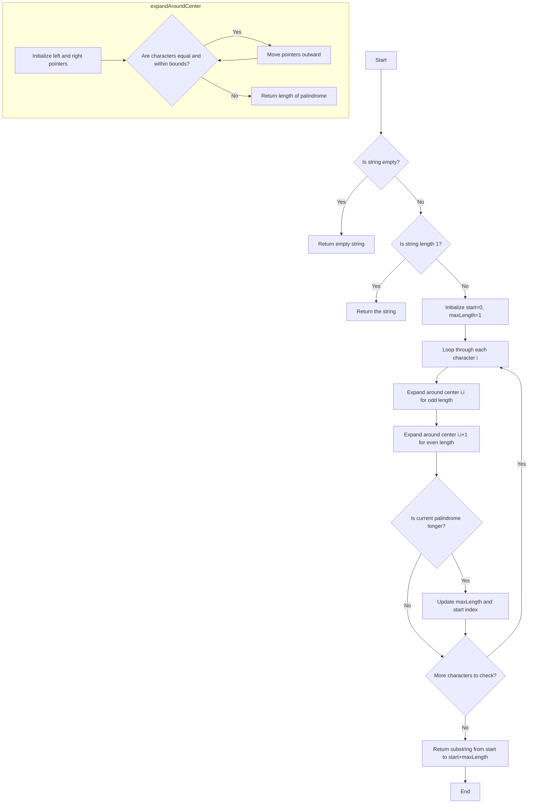

# **Longest Palindromic Substring**

```mermaid
flowchart TD
    A[Start] --> B{Is string empty?}
    B -- Yes --> C[Return empty string]
    B -- No --> D{Is string length 1?}
    D -- Yes --> E[Return the string]
    D -- No --> F[Initialize start=0, maxLength=1]
    F --> G[Loop through each character i]
    G --> H[Expand around center i,i for odd length]
    H --> I[Expand around center i,i+1 for even length]
    I --> J{Is current palindrome longer?}
    J -- Yes --> K[Update maxLength and start index]
    J -- No --> L{More characters to check?}
    K --> L
    L -- Yes --> G
    L -- No --> M[Return substring from start to start+maxLength]
    M --> N[End]

    subgraph expandAroundCenter
        O[Initialize left and right pointers]
        O --> P{Are characters equal and within bounds?}
        P -- Yes --> Q[Move pointers outward]
        Q --> P
        P -- No --> R[Return length of palindrome]
    end
```
