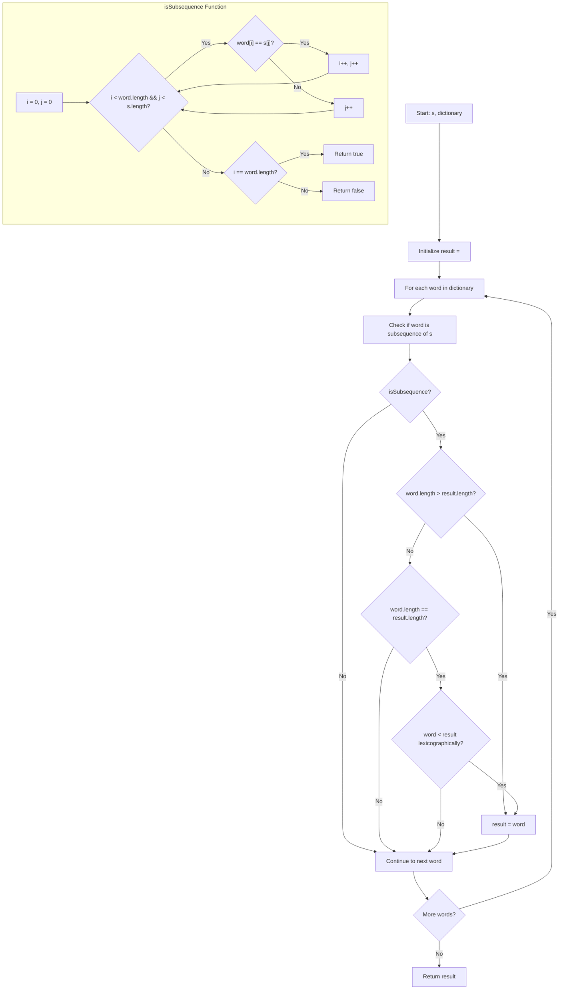

# *524. Longest Word in Dictionary through Deleting*

```mermaid
flowchart TD
    A[Start: s, dictionary] --> B[Initialize result = ""]
    B --> C[For each word in dictionary]
    C --> D[Check if word is subsequence of s]

    D --> E{isSubsequence?}
    E -->|No| F[Continue to next word]
    E -->|Yes| G{word.length > result.length?}
    
    G -->|Yes| H[result = word]
    G -->|No| I{word.length == result.length?}
    
    I -->|No| F
    I -->|Yes| J{word < result lexicographically?}
    
    J -->|Yes| H
    J -->|No| F
    
    H --> F
    F --> K{More words?}
    K -->|Yes| C
    K -->|No| L[Return result]
    
    subgraph "isSubsequence Function"
        M[i = 0, j = 0] --> N{i < word.length && j < s.length?}
        N -->|No| O{i == word.length?}
        N -->|Yes| P{"word[i] == s[j]?"}
        P -->|Yes| Q[i++, j++]
        P -->|No| R[j++]
        Q --> N
        R --> N
        O -->|Yes| S[Return true]
        O -->|No| T[Return false]
    end
```
