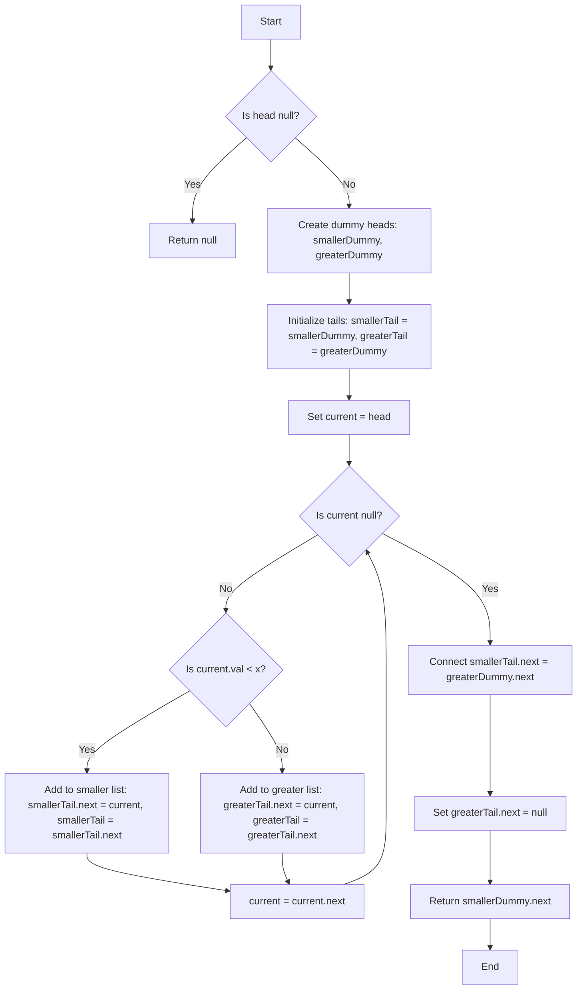

# **Partition List Flowchart**

```mermaid
flowchart TD
    A[Start] --> B{Is head null?}
    B -->|Yes| C[Return null]
    B -->|No| D[Create dummy heads: smallerDummy, greaterDummy]
    D --> E[Initialize tails: smallerTail = smallerDummy, greaterTail = greaterDummy]
    E --> F[Set current = head]
    F --> G{Is current null?}
    G -->|Yes| K[Connect smallerTail.next = greaterDummy.next]
    G -->|No| H{Is current.val < x?}
    H -->|Yes| I[Add to smaller list: smallerTail.next = current, smallerTail = smallerTail.next]
    H -->|No| J[Add to greater list: greaterTail.next = current, greaterTail = greaterTail.next]
    I --> L[current = current.next]
    J --> L
    L --> G
    K --> M[Set greaterTail.next = null]
    M --> N[Return smallerDummy.next]
    N --> O[End]
```
