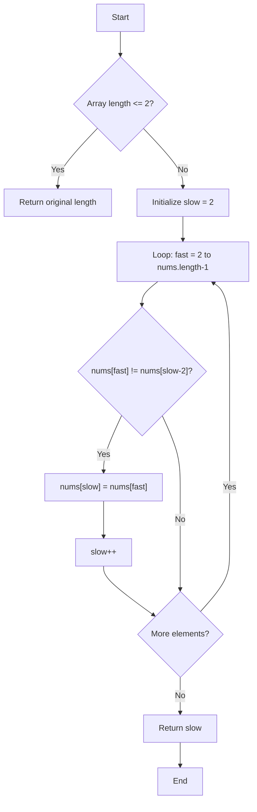

# **Remove Duplicates from Sorted Array II Flowchart**

```mermaid
flowchart TD
    A[Start] --> B{Array length <= 2?}
    B -- Yes --> C[Return original length]
    B -- No --> D[Initialize slow = 2]
    D --> E[Loop: fast = 2 to nums.length-1]
    E --> F{"nums[fast] != nums[slow-2]?"}
    F -- Yes --> G["nums[slow] = nums[fast]"]
    G --> H[slow++]
    H --> I{More elements?}
    F -- No --> I
    I -- Yes --> E
    I -- No --> J[Return slow]
    J --> K[End]
```
