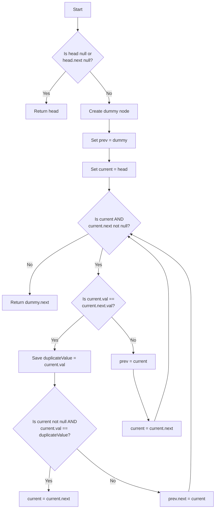

# **Flowchart for Remove Duplicates from Sorted List II**

```mermaid
flowchart TD
    A[Start] --> B{Is head null or\nhead.next null?}
    B -->|Yes| C[Return head]
    B -->|No| D[Create dummy node]
    D --> E[Set prev = dummy]
    E --> F[Set current = head]
    F --> G{Is current AND\ncurrent.next not null?}
    G -->|No| H[Return dummy.next]
    G -->|Yes| I{Is current.val ==\ncurrent.next.val?}
    I -->|Yes| J[Save duplicateValue = current.val]
    J --> K{Is current not null AND\ncurrent.val == duplicateValue?}
    K -->|Yes| L[current = current.next]
    K -->|No| M[prev.next = current]
    M --> G
    I -->|No| N[prev = current]
    N --> O[current = current.next]
    O --> G
```
