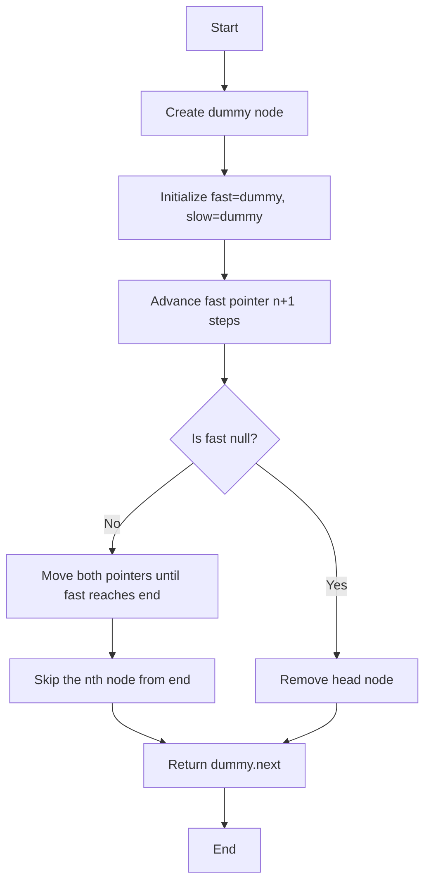

# **Remove Nth Node From End Flowchart**

```mermaid
flowchart TD
    A[Start] --> B[Create dummy node]
    B --> C[Initialize fast=dummy, slow=dummy]
    C --> D[Advance fast pointer n+1 steps]
    D --> E{Is fast null?}
    E -- Yes --> F[Remove head node]
    E -- No --> G[Move both pointers until fast reaches end]
    G --> H[Skip the nth node from end]
    H --> I[Return dummy.next]
    F --> I
    I --> J[End]
```
