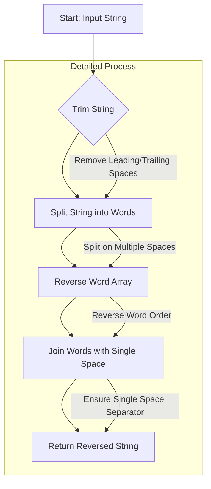

# **Reverse Words Flowchart**

```mermaid
flowchart TD
    A[Start: Input String] --> B{Trim String}
    B --> C[Split String into Words]
    C --> D[Reverse Word Array]
    D --> E[Join Words with Single Space]
    E --> F[Return Reversed String]

    subgraph Detailed Process
    B --> |Remove Leading/Trailing Spaces| C
    C --> |Split on Multiple Spaces| D
    D --> |Reverse Word Order| E
    E --> |Ensure Single Space Separator| F
    end
```
