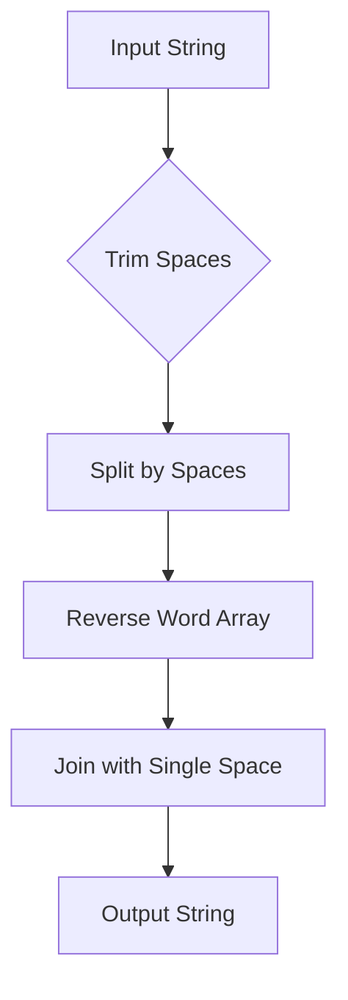

# **151. Reverse Words in a String**

Alright! Let’s break down **LeetCode 151: Reverse Words in a String** step by step.  

---

## **1. Problem Understanding**  

We need to **reverse the order of words** in a given string while ensuring that:  

- Words are separated by a **single space** in the final output.  
- There are **no leading or trailing spaces** in the final output.  
- Multiple spaces between words in the input should be **reduced to a single space** in the output.  

### **Example Walkthrough**

| Input | Expected Output |
|--------|----------------|
| `"the sky is blue"` | `"blue is sky the"` |
| `"  hello world  "` | `"world hello"` |
| `"a good   example"` | `"example good a"` |

---

## **2. Constraints of the Problem**

- **String length**: \(1 \leq s.length \leq 10^4\), meaning we should aim for an efficient solution.  
- **Characters**: Can contain uppercase/lowercase letters, digits, and spaces.  
- **There is at least one word**, so we don’t need to handle empty strings.  

---

## **3. Breaking Down the Problem into Manageable Parts**

We can solve this problem in these logical steps:  

1. **Remove leading and trailing spaces**.  
2. **Split the words** using spaces (ensuring multiple spaces are ignored).  
3. **Reverse the list of words**.  
4. **Join the words back with a single space**.  

---

## **4. Pattern Identification**

The key techniques that apply here:  

- **String Manipulation**: Removing spaces and handling substrings efficiently.  
- **Two-Pointer Technique (for in-place solution)**: Useful for an optimal approach.  

---

## **5. Approach Discussion**

### **Approach 1: Using Built-in Functions (Simple & Readable)**

- **Trim spaces** from the input.  
- **Split** the string into words (automatically removes extra spaces).  
- **Reverse** the list of words.  
- **Join** them back with a single space.  

#### **Time Complexity**  

- **Splitting (`O(n)`)**, **Reversing (`O(n)`)**, and **Joining (`O(n)`)** → **Overall: \(O(n)\)**  
- **Space Complexity**: \(O(n)\) (since we use an array to store words).  

---

### **6. Code Implementation (JavaScript)**

```javascript
var reverseWords = function(s) {
    // Step 1: Trim spaces and split words using regex
    let words = s.trim().split(/\s+/);
    
    // Step 2: Reverse the array of words
    words.reverse();
    
    // Step 3: Join words with a single space
    return words.join(" ");
};

// Example runs
console.log(reverseWords("the sky is blue")); // Output: "blue is sky the"
console.log(reverseWords("  hello world  ")); // Output: "world hello"
console.log(reverseWords("a good   example")); // Output: "example good a"
```

---

### **7. Complexity Analysis**

- **Time Complexity**: \(O(n)\) → **Splitting, reversing, and joining all take linear time**.  
- **Space Complexity**: \(O(n)\) → **We store words in an array**.  

---

## **8. Alternative Solution: In-Place Two-Pointer Approach (O(1) Extra Space)**

If we need an **in-place solution**, we can use a **two-pointer** approach:

1. **Reverse the entire string**.  
2. **Reverse each word individually**.  
3. **Remove extra spaces efficiently**.  

```javascript
var reverseWordsInPlace = function(s) {
    // Step 1: Convert string to array (JavaScript strings are immutable)
    let arr = s.split("");
    
    // Step 2: Reverse the whole array
    reverse(arr, 0, arr.length - 1);

    // Step 3: Reverse each word
    reverseEachWord(arr);
    
    // Step 4: Clean up spaces
    return cleanSpaces(arr);
};

// Helper function to reverse part of the array
function reverse(arr, left, right) {
    while (left < right) {
        [arr[left], arr[right]] = [arr[right], arr[left]];
        left++;
        right--;
    }
}

// Reverse each word
function reverseEachWord(arr) {
    let start = 0;
    let n = arr.length;
    
    for (let end = 0; end < n; end++) {
        if (arr[end] === " ") {
            reverse(arr, start, end - 1);
            start = end + 1;
        }
    }
    // Reverse the last word
    reverse(arr, start, n - 1);
}

// Clean up extra spaces
function cleanSpaces(arr) {
    let i = 0;
    let j = 0;
    let n = arr.length;

    while (j < n) {
        // Skip leading spaces
        while (j < n && arr[j] === " ") j++;

        // Keep words
        while (j < n && arr[j] !== " ") arr[i++] = arr[j++];

        // Skip spaces between words (keep only one)
        while (j < n && arr[j] === " ") j++;

        // Add a single space if there are still words
        if (j < n) arr[i++] = " ";
    }

    return arr.slice(0, i).join("");
}

// Example runs
console.log(reverseWordsInPlace("the sky is blue")); // Output: "blue is sky the"
console.log(reverseWordsInPlace("  hello world  ")); // Output: "world hello"
console.log(reverseWordsInPlace("a good   example")); // Output: "example good a"
```

---

### **9. Alternative Solutions and Optimizations**

| Approach | Time Complexity | Space Complexity | Notes |
|----------|----------------|------------------|-------|
| **Built-in Functions (trim, split, reverse, join)** | \(O(n)\) | \(O(n)\) | Simple and effective |
| **Two-Pointer In-Place Reversal** | \(O(n)\) | \(O(1)\) | Optimized for in-place modification |
| **Stack Approach** | \(O(n)\) | \(O(n)\) | Uses a stack to store words |

---

## **10. Practice Recommendations**

To strengthen this pattern of **string manipulation and two-pointer technique**, try these problems:

1. **LeetCode 186** - Reverse Words in a String II (In-Place)
2. **LeetCode 344** - Reverse String
3. **LeetCode 557** - Reverse Words in a String III (Reverse each word in-place)
4. **LeetCode 273** - Integer to English Words (String processing)

---

## **11. Flowchart Design**

Here’s a **Mermaid flowchart** representing the high-level steps of the simple approach:



---

## **Final Thoughts**

- The built-in **split-reverse-join** method is **concise and effective**.  
- The **in-place two-pointer** method is **optimized** for minimal space usage.  
- Understanding **string manipulation and two-pointer techniques** is essential for **interview success**.  

Would you like me to go deeper into **another optimization or alternative approach**? 🚀
