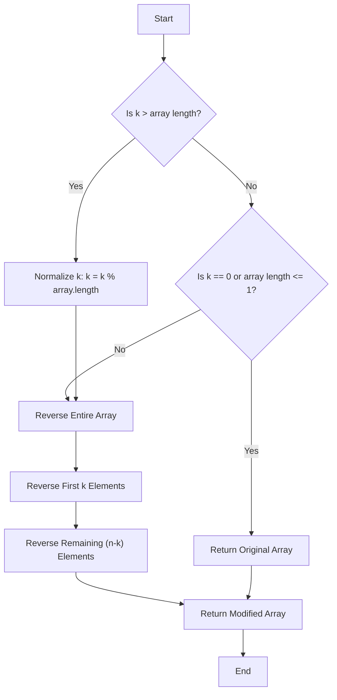

# **Rotate Array**

```mermaid
flowchart TD
    A[Start] --> B{Is k > array length?}
    B -->|Yes| C[Normalize k: k = k % array.length]
    B -->|No| D{Is k == 0 or array length <= 1?}
    D -->|Yes| E[Return Original Array]
    D -->|No| F[Reverse Entire Array]
    C --> F
    F --> G[Reverse First k Elements]
    G --> H["Reverse Remaining (n-k) Elements"]
    H --> I[Return Modified Array]
    E --> I
    I --> J[End]
```
