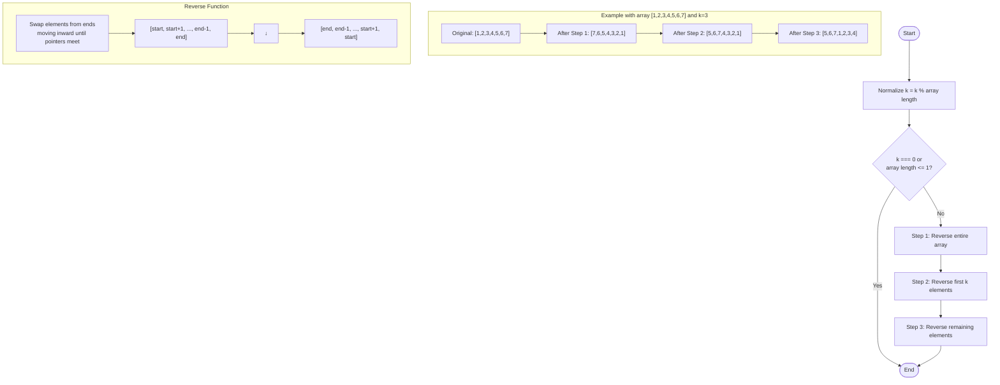

# **Rotation Algorithm**

```mermaid
flowchart TD
    Start([Start]) --> Normalize[Normalize k = k % array length]
    Normalize --> Trivial{k === 0 or\narray length <= 1?}
    Trivial -->|Yes| End([End])
    Trivial -->|No| Step1[Step 1: Reverse entire array]
    Step1 --> Step2[Step 2: Reverse first k elements]
    Step2 --> Step3[Step 3: Reverse remaining elements]
    Step3 --> End

    subgraph "Example with array [1,2,3,4,5,6,7] and k=3"
        E1["Original: [1,2,3,4,5,6,7]"]
        E2["After Step 1: [7,6,5,4,3,2,1]"]
        E3["After Step 2: [5,6,7,4,3,2,1]"]
        E4["After Step 3: [5,6,7,1,2,3,4]"]
        
        E1 --> E2
        E2 --> E3
        E3 --> E4
    end
    
    subgraph "Reverse Function"
        R1["Swap elements from ends\nmoving inward until pointers meet"]
        R2["[start, start+1, ..., end-1, end]"]
        R3["↓"]
        R4["[end, end-1, ..., start+1, start]"]
        
        R1 --> R2
        R2 --> R3
        R3 --> R4
    end
```
