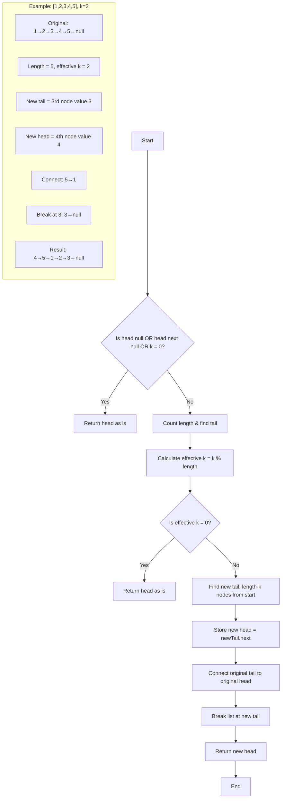

# **Rotate List Solution Flowchart**

```mermaid
flowchart TD
    A[Start] --> B{Is head null OR head.next null OR k = 0?}
    B -->|Yes| C[Return head as is]
    B -->|No| D[Count length & find tail]
    D --> E[Calculate effective k = k % length]
    E --> F{Is effective k = 0?}
    F -->|Yes| G[Return head as is]
    F -->|No| H[Find new tail: length-k nodes from start]
    H --> I[Store new head = newTail.next]
    I --> J[Connect original tail to original head]
    J --> K[Break list at new tail]
    K --> L[Return new head]
    L --> M[End]

    subgraph "Example: [1,2,3,4,5], k=2"
        N[Original: 1→2→3→4→5→null]
        O[Length = 5, effective k = 2]
        P[New tail = 3rd node value 3]
        Q[New head = 4th node value 4]
        R[Connect: 5→1]
        S[Break at 3: 3→null]
        T[Result: 4→5→1→2→3→null]
    end
```
