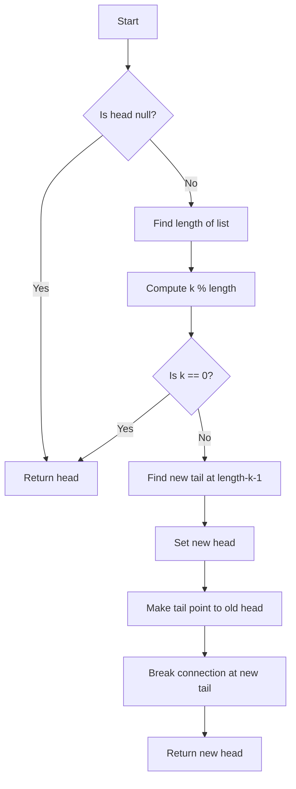

# 🔍 Understanding the Problem  

We are given a singly linked list and a number \( k \). We need to **rotate the list to the right by \( k \) places**.  

## ✅ **Key Constraints & Edge Cases**

1. **Empty list:** If the list is empty (`head == None`), return `None`.
2. **Single node list:** If there's only one node, rotating doesn't change anything.
3. **When \( k \) is zero:** The list remains unchanged.
4. **Large \( k \):** Since \( k \) can be very large, we can optimize by using `k % length_of_list` to avoid unnecessary rotations.

---

## 🛠️ Breaking the Problem into Steps  

1. **Find the length** of the linked list.
2. **Optimize \( k \)** by computing `k = k % length` to avoid redundant rotations.
3. **Find the new tail** (the node just before the new head).
4. **Rearrange pointers** to complete the rotation.

---

## 🔍 Identifying the Algorithmic Pattern  

The problem falls under the **Linked List manipulation** category and can be efficiently solved using:

- **Two Pointers:** One pointer to traverse and find the tail, another to locate the new head.
- **Modulo Arithmetic:** Helps optimize large values of \( k \).
- **Pointer Rewiring:** To adjust the list structure.

---

## 📝 **Approach**

### 🔹 Step 1: Compute the Length of the List

- Traverse the linked list to determine its length \( n \).
  
### 🔹 Step 2: Optimize \( k \)

- Since rotating \( n \) times results in the same list, reduce \( k \) using `k = k % n`.

### 🔹 Step 3: Locate the New Tail

- The new head will be at position \( n - k \).
- The node before it becomes the new tail.

### 🔹 Step 4: Rotate the List

- Set the new head and tail.
- Update pointers accordingly.

---

## 💻 **Code Implementation (JavaScript)**

```javascript
class ListNode {
    constructor(val, next = null) {
        this.val = val;
        this.next = next;
    }
}

var rotateRight = function(head, k) {
    if (!head || k === 0) return head;

    // Step 1: Compute the length of the list
    let length = 1;
    let tail = head;
    while (tail.next) {
        tail = tail.next;
        length++;
    }

    // Step 2: Optimize k
    k = k % length;
    if (k === 0) return head;  // No change if k is a multiple of length

    // Step 3: Find the new tail (at position length - k - 1)
    let newTail = head;
    for (let i = 0; i < length - k - 1; i++) {
        newTail = newTail.next;
    }

    // Step 4: Rotate the list
    let newHead = newTail.next;
    newTail.next = null;
    tail.next = head;  // Connect old tail to old head

    return newHead;
};
```

---

## 📊 **Time & Space Complexity Analysis**

- **Time Complexity:** \( O(n) \)  
  - Finding the length takes \( O(n) \).
  - Finding the new head takes \( O(n) \).
  - Rearranging pointers is \( O(1) \).
  
- **Space Complexity:** \( O(1) \)  
  - No extra space is used apart from pointers.

---

## 🔄 **Alternative Approaches**

1. **Using a Circular Linked List**  
   - Instead of iterating twice, make the list circular and break it at the right position.
   - Pros: Saves one iteration.
   - Cons: More pointer manipulations.

---

## 🔥 **Practice Recommendations**

1. **Medium**
   - [Linked List Cycle (LC 141)](https://leetcode.com/problems/linked-list-cycle/)
   - [Remove Nth Node From End (LC 19)](https://leetcode.com/problems/remove-nth-node-from-end-of-list/)
  
2. **Hard**
   - [Reverse Nodes in k-Group (LC 25)](https://leetcode.com/problems/reverse-nodes-in-k-group/)

---

## 📌 **Flowchart (Mermaid)**



---

## 🎯 **Key Takeaways**

✅ Optimize \( k \) using modulo to avoid unnecessary rotations.  
✅ Use **two pointers** to efficiently find the new head and tail.  
✅ **Rearrange pointers** instead of physically shifting elements.  
✅ **Time Complexity:** \( O(n) \), **Space Complexity:** \( O(1) \).  

Would you like me to generate test cases for better understanding? 🚀
