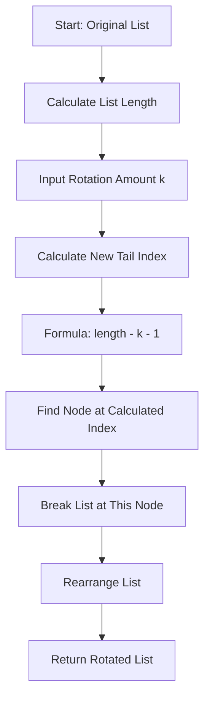

# **rotation-math-flowchart**

```mermaid
flowchart TD
    A[Start: Original List] --> B[Calculate List Length]
    B --> C[Input Rotation Amount k]
    C --> D[Calculate New Tail Index]
    D --> E[Formula: length - k - 1]
    E --> F[Find Node at Calculated Index]
    F --> G[Break List at This Node]
    G --> H[Rearrange List]
    H --> I[Return Rotated List]
```
