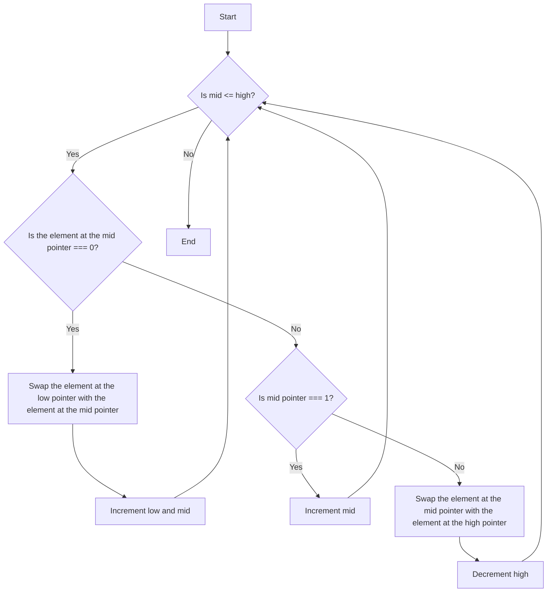

# **75. Sort Colors**

## **Understanding the Problem**  

We are given an array `nums` consisting of integers `0`, `1`, and `2`, representing colors red, white, and blue, respectively. Our goal is to sort the array **in-place** such that all `0`s come first, followed by `1`s, and then `2`s.  

### **Constraints & Edge Cases**  

- We cannot use built-in sorting functions like `sort()`.  
- The array size is between `1` and `300`.  
- We need to solve it in **one pass** (`O(n)`) and with **constant extra space** (`O(1)`).  
- Edge cases:  
  - Already sorted array: `[0,0,1,1,2,2]`  
  - Reverse sorted array: `[2,2,1,1,0,0]`  
  - Array with only one type of number: `[0,0,0]` or `[1,1]`  
  - Single element array: `[2]`  

---

## **Identifying the Pattern**  

The problem requires **sorting an array with only three distinct values**. The optimal approach is the **Dutch National Flag Algorithm**, which uses the **two-pointer technique** to sort the array in **one pass**.  

---

## **Approach - Dutch National Flag Algorithm**  

### **Idea**  

We maintain three pointers:  

1. `low` → Points to the boundary where `0`s should be placed.  
2. `mid` → Scans the array and sorts values.  
3. `high` → Points to the boundary where `2`s should be placed.  

### **Algorithm Steps**  

1. Initialize `low = 0`, `mid = 0`, and `high = n - 1`.  
2. Iterate while `mid <= high`:  
   - If `nums[mid] == 0`: Swap `nums[mid]` and `nums[low]`, then move both pointers forward.  
   - If `nums[mid] == 1`: It is already in the correct place, so just move `mid` forward.  
   - If `nums[mid] == 2`: Swap `nums[mid]` and `nums[high]`, then move `high` backward.  
3. Continue until `mid` surpasses `high`.  

---

## **Code Implementation (JavaScript)**

```javascript
var sortColors = function(nums) {
    let low = 0, mid = 0, high = nums.length - 1;
    
    while (mid <= high) {
        if (nums[mid] === 0) {
            [nums[low], nums[mid]] = [nums[mid], nums[low]];
            low++;
            mid++;
        } else if (nums[mid] === 1) {
            mid++;
        } else {
            [nums[mid], nums[high]] = [nums[high], nums[mid]];
            high--;
        }
    }
};
```

### **Explanation of the Code**

- We iterate over the array using `mid` and adjust elements in one pass (`O(n)` complexity).  
- Swapping ensures that we only move `0`s to the front and `2`s to the end, keeping `1`s in place.  
- Since we use only a few variables, space complexity remains `O(1)`.  

---

## **Time & Space Complexity Analysis**  

- **Time Complexity**: **O(n)** → Each element is processed at most once.  
- **Space Complexity**: **O(1)** → No extra memory is used apart from the input array.  

---

## **Alternative Approaches**  

### **1. Counting Sort (Two-pass solution)**

- **Count occurrences** of `0`, `1`, and `2`, then overwrite the array accordingly.
- **Time Complexity**: **O(n)**
- **Space Complexity**: **O(1)**  

```javascript
var sortColors = function(nums) {
    let count0 = 0, count1 = 0, count2 = 0;
    
    for (let num of nums) {
        if (num === 0) count0++;
        else if (num === 1) count1++;
        else count2++;
    }
    
    for (let i = 0; i < nums.length; i++) {
        if (i < count0) nums[i] = 0;
        else if (i < count0 + count1) nums[i] = 1;
        else nums[i] = 2;
    }
};
```

💡 **Why is this suboptimal?**  

- Requires **two passes** over the array instead of one.  
- Though still `O(n)`, it's **not truly in-place**, as we first count elements.  

---

## **Similar Practice Problems**

1. **Leetcode 26** – Remove Duplicates from Sorted Array  
2. **Leetcode 27** – Remove Element  
3. **Leetcode 283** – Move Zeroes  
4. **Leetcode 905** – Sort Array by Parity  

---

## **Flowchart Representation**



---

## **Final Thoughts**

- The **Dutch National Flag Algorithm** is a classic **in-place** sorting technique.  
- Recognizing that **only three distinct numbers exist** makes this problem easier.  
- Mastering this pattern is crucial for solving **partitioning and sorting problems** in one pass.  

🚀 Let me know if you have any doubts or need further clarification!
