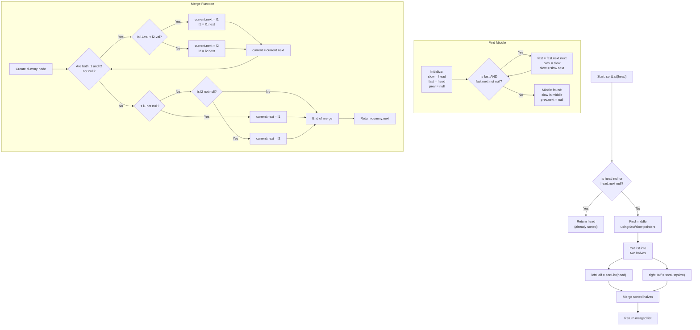

# **Sort List Flowchart**

```mermaid
flowchart TD
    A["Start: sortList(head)"] --> B{Is head null or\nhead.next null?}
    B -->|Yes| C["Return head\n(already sorted)"]
    B -->|No| D[Find middle\nusing fast/slow pointers]
    
    D --> E[Cut list into\ntwo halves]
    E --> F["leftHalf = sortList(head)"]
    E --> G["rightHalf = sortList(slow)"]
    
    F --> H[Merge sorted halves]
    G --> H
    
    H --> I[Return merged list]
    
    subgraph "Find Middle"
        D1[Initialize:\nslow = head\nfast = head\nprev = null] --> D2{Is fast AND\nfast.next not null?}
        D2 -->|Yes| D3[fast = fast.next.next\nprev = slow\nslow = slow.next]
        D3 --> D2
        D2 -->|No| D4[Middle found:\nslow is middle\nprev.next = null]
    end
    
    subgraph "Merge Function"
        H1[Create dummy node] --> H2{Are both l1 and l2\nnot null?}
        H2 -->|Yes| H3{Is l1.val < l2.val?}
        H3 -->|Yes| H4[current.next = l1\nl1 = l1.next]
        H3 -->|No| H5[current.next = l2\nl2 = l2.next]
        H4 --> H6[current = current.next]
        H5 --> H6
        H6 --> H2
        H2 -->|No| H7{Is l1 not null?}
        H7 -->|Yes| H8[current.next = l1]
        H7 -->|No| H9{Is l2 not null?}
        H9 -->|Yes| H10[current.next = l2]
        H9 -->|No| H11[End of merge]
        H8 --> H11
        H10 --> H11
        H11 --> H12[Return dummy.next]
    end
```
