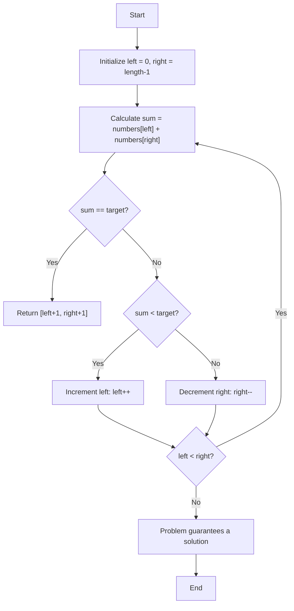

# **Two Sum Flowchart**

```mermaid
flowchart TD
    A[Start] --> B[Initialize left = 0, right = length-1]
    B --> C["Calculate sum = numbers[left] + numbers[right]"]
    C --> D{"sum == target?"}
    D -->|Yes| E["Return [left+1, right+1]"]
    D -->|No| F{"sum < target?"}
    F -->|Yes| G[Increment left: left++]
    F -->|No| H[Decrement right: right--]
    G --> I{"left < right?"}
    H --> I
    I -->|Yes| C
    I -->|No| J[Problem guarantees a solution]
    J --> K[End]
```
