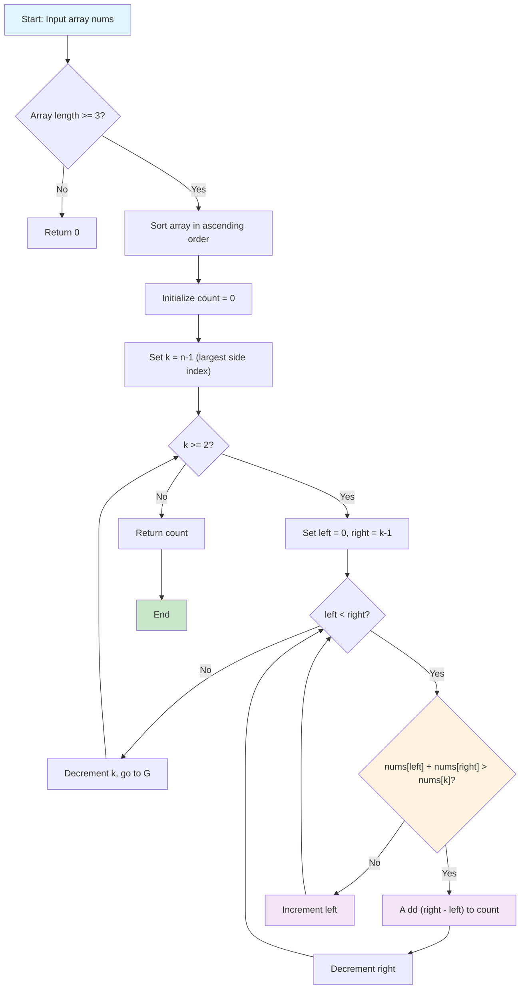

# **Valid Triangle Number**

```mermaid
flowchart TD
    A["Start: Input array nums"] --> B{Array length >= 3?}
    B -->|No| C[Return 0]
    B -->|Yes| D[Sort array in ascending order]
    
    D --> E[Initialize count = 0]
    E --> F["Set k = n-1 (largest side index)"]
    
    F --> G{k >= 2?}
    G -->|No| H[Return count]
    G -->|Yes| I[Set left = 0, right = k-1]
    I --> J{left < right?}
    J -->|No| K[Decrement k, go to G]
    J -->|Yes| L{"nums[left] + nums[right] > nums[k]?"}
    
    L -->|Yes| M["A dd (right - left) to count"]
    M --> N[Decrement right]
    N --> J
    
    L -->|No| O[Increment left]
    O --> J
    
    K --> G
    H --> P[End]
    
    style A fill:#e1f5fe
    style P fill:#c8e6c9
    style L fill:#fff3e0
    style M fill:#f3e5f5
    style O fill:#f3e5f5
```
